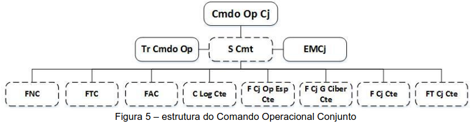
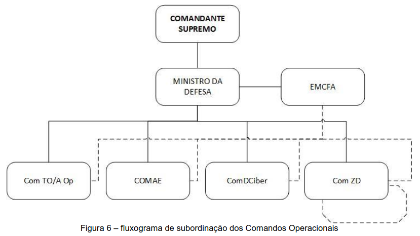

## Página 45

# Capítulo IV - Comando Operacional Conjunto

### 4.1 Estrutura

4.1.1 O Comando Operacional Conjunto constitui-se de:

    (a) Comandante;
    (b) Estado-Maior Conjunto (EMCj; e
    (c) Tropas do Cmdo Op (meios necessários ao C², apoio Adm / Log, autoproteção — Unidade de Polícia, DAAe -, reserva etc.);
    (d) Forças Componentes (F Cte).

4.1.2 A determinação da estrutura a ser adotada pelo Comando Operacional é de competência de seu Comandante que tem total flexibilidade de organização de modo a adaptála a cada situação ou evolução durante a operação/campanha. De acordo com a amplitude da área de responsabilidade, da magnitude das forças existentes e/ou da complexidade das ações a serem realizadas, poderá ser designado um Subcomandante, por solicitação do Comandante Operacional.

4.1.3 A critério do Cmt Op, as F Cte poderão ser:

a) Forças Singulares — Força Naval Componente (FNC), Força Terrestre Componente (FTC) e Força Aérea Componente (FAC) em situações específicas; ou

b) Forças Conjuntas — Força Conjunta Componente (F Cj Cte), Força-Tarefa Conjunta Componente (FT Cj Cte), Força Conjunta de Operações Especiais Componente (F Cj Op Esp Cte), Força Conjunta de Guerra Cibernética Componente (F Cj G Ciber Cte), Comando Logístico Componente (C Log Cte) e outras modalidades, tantas quanto forem necessárias.

4.1.3.1 Por Força Componente entende-se a Força constituída de meios das FS, adjudicados a um Comando Operacional. Pode ser organizada de forma singular ou conjunta.

4.1.3.2 Por Força Conjunta entende-se a Força composta por elementos de mais de uma Força Armada, sob comando único.

4.1.3.3 Por Força-Tarefa entende-se a Força organizada com comando próprio, constituída de meios adjudicados das FS ou constituída por meios do próprio Comando Operacional, para o cumprimento de missão específica, com objetivos e duração limitados no tempo. As FT podem ser organizadas no nível tático, sendo, nesse caso, de responsabilidade das F Cte.

4.1.4 A organização por Forças Componentes Singulares apresenta a característica de homogeneidade de relacionamento simples dentro de cada força e, principalmente, permite que cada comandante conheça profundamente os meios subordinados nos aspectos operacionais, logísticos e de adestramento.

## Página 46

4.1.5 Por outro lado, a organização por Forças Conjuntas Componentes proporciona maior flexibilidade, permitindo distribuir os meios de forma balanceada, empregando-os nas três dimensões da guerra, na terra, no mar e no ar, aumentando a sinergia de emprego pela facilidade de coordenação advinda de uma maior gama de capacidades disponíveis sob um comando único. Sempre que possível deve ser a forma de organização priorizada.

4.1.6 No momento de definir qual o tipo de estrutura (organização por tarefas) a ser adotada, o Comandante Operacional deverá considerar as vantagens e as desvantagens de emprego de Forças Singulares e/ou conjuntas, as características de cada área de responsabilidade, a natureza das ações a serem empreendidas, as possibilidades ou limitações de apoio mútuo entre os escalões subordinados e do apoio logístico. Seu foco deverá estar, sempre, no cumprimento da sua missão da forma mais eficiente possível.

4.1.7 Na definição da estrutura do Comando Operacional, o Comandante deve ponderar sobre a observância de uma ou mais das condições listadas abaixo para que uma força seja considerada como Componente, levando em conta que o apoio de fogo e ao movimento são capacidades inerentes a situação de F Cte:
a) contribuir para a conquista do Estado Final operacional;
b) possuir meios de mais de uma força singular, no caso de a Força Componente ser conjunta;
c) possuir capacidade de Comando e Controle (Esc superior e considerado);
d) que a natureza das atividades seja de cunho operativo (funcional ou área geográfica) e não administrativo/assessoria;
e) quando o vulto da Força Singular representar parcela ponderável do esforço administrativo e logístico da Força Conjunta considerada; e
f) quando contribuir para os efeitos associados aos Pontos Decisivos.

4.1.8 Cabe observar que, embora o planejamento seja conjunto e a sinergia das ações seja uma meta a ser buscada, para resguardar os princípios da simplicidade e economia de meios, cada meio adjudicado deve ser empregado de acordo com o seu tipo de preparo, englobando aí aspectos doutrinários, de adestramento e de equipamento.

**Figura 5 – estrutura do Comando Operacional Conjunto**

### 4.2 Do Comando Operacional Conjunto 

4.2.1 A missão atribuída, as características geográficas da área de atuação, os meios à disposição, as possibilidades do inimigo e a estrutura do apoio logístico a ser adotada serão os fatores que determinarão a composição do C Op.

## Página 47

4.2.2 Os Comandos Operacionais Conjuntos, quando ativados, ficarão subordinados ao CS, por intermédio do Ministro da Defesa, para situações de emprego de guerra e não guerra, conforme a figura 6.

4.2.3 O Comando Operacional Conjunto deverá buscar observar os seguintes aspectos:

   **(a) coordenação:** ação necessária que visa ao entrosamento de diferentes setores e atividades, promovendo a sinergia das ações e a otimização dos recursos disponíveis, evitando a duplicidade de ações, a dispersão de recursos e a interferência mútua;
   **(b) liberdade de ação:** capacidade de agir de maneira descentralizada e específica, mantendo as características de cada Força Componente;
   **(c) flexibilidade:** capacidade de organizar os meios para atender às diferentes fases de um plano ou ordem de operações, face aos óbices reinantes, de acordo com os objetivos estabelecidos;
   **(d) uniformidade doutrinária:** observância dos preceitos da doutrina de emprego conjunto;
   **(e) conhecimento recíproco:** conhecimento das possibilidades, limitações, estrutura e funcionamento, entre as forças componentes empregadas.

### 4.3 Do Comandante Operacional

4.3.1 O comando de uma operação conjunta, embora semelhante ao de qualquer outra operação, diferencia-se pela heterogeneidade dos processos de emprego e pelas peculiaridades técnico-profissionais das forças componentes.

4.3.2 O Cmt, no Nível Operacional, sincronizará ações de forças de naturezas diversas na condução de uma campanha/operação, a fim de alcançar os objetivos operacionais, em harmonia com os esforços empreendidos pelas demais expressões do Poder Nacional.

## Página 48

4.3.3 Desempenhará as suas funções assessorado pelo S Cmt, SFC, pelo Estado-Maior Conjunto e pelos Comandantes das Forças Componentes. Também, poderá valer-se de assessores especiais, oriundos de outros ministérios e órgãos governamentais, particularmente nas operações em ambiente interagências.

4.3.4 A princípio, não deverá comandar, diretamente, meios ou forças militares, salvo em situações temporárias e excepcionais e desde que isto possa, efetivamente, representar vantagens significativas em termos operacionais.

4.3.5 Além das responsabilidades operativas inerentes à sua função, terá como atribuições:

(a) organizar as forças subordinadas, atribuindo-lhes meios e definindo as relações de comando;
(b) estabelecer diretrizes, quando um comando subordinado solicitar, assistência quanto à administração, instrução, justiça e disciplina às F Cte;
(c) estabelecer a missão dos comandantes subordinados e suas respectivas responsabilidades;
(d) estabelecer e disseminar as Regras de Engajamento no Nível Operacional;
(e) estabelecer e priorizar as Necessidades de Inteligência (NI), visando ao processo decisório, tanto para o planejamento quanto para a condução das operações militares;
(f) coordenar o apoio logístico de todas as forças subordinadas;
(g) servir de interlocutor com os escalões superiores e pares, zelando pela manutenção da consciência situacional naquilo que seja relevante aos níveis de decisão Estratégico e Político; e
(h) estabelecer contato cerrado com as autoridades regionais/estaduais em sua área de responsabilidade, a fim de manter as atividades de assuntos civis em bons termos de apoio e execução.
(i) aprovar a Lista de Necessidades Final (LNF) feitas pelo C Log Cte ou, na sua inexistência, pela D-4.

4.3.6 Compete exercer a comando operacional sobre a logística em sua área de responsabilidade, delegando a um Comandante Logístico a coordenação e a execução da logística e da segurança de área de retaguarda.

4.3.7 Aos Cmt de Área de Operações (A Op) e das Zonas de Defesa (ZD), quando ativadas, caberão, em princípio, as atribuições logísticas de um ComTO.

### 4.4 Do Comandante de Força Componente

4.4.1 Além das responsabilidades e prerrogativas inerentes à sua função, terá como atribuições:

(a) assessorar o seu comandante imediatamente superior quanto ao emprego apropriado dos seus meios, informando, especialmente, as questões de caráter jurídico, técnico, tático e logístico;

(b) zelar pela manutenção da consciência situacional do seu escalão superior, naquilo que seja relevante ao nível de decisão considerado, particularmente nos aspectos militares que poderão ter impactos políticos/estratégicos;-

## Página 49

(c) operar, na sua área de responsabilidade, em coordenação com o € Log Cte, suas redes de distribuição nos diversos escalões, de acordo com os procedimentos peculiares de suas tropas e respectivas FS, usando os canais de distribuição estabelecidos; e
(d) planejar de forma a priorizar as tarefas logísticas conjuntas, dentro da sua área de responsabilidade, de acordo com a determinação do Cmt Op, em coordenação com o C Log Cte.

### 4.5 Do Comandante Logístico Componente

4.5.1 A ele compete, além das já citadas para os Cmt das F Cte, as seguintes atribuições:

(a) assessorar o Comandante Operacional, quanto ao planejamento e à execução do Anexo de Logística ao Plano Operacional;

(b) gerenciar todo o fluxo de apoio logístico no TO ou A Op, racionalizando os meios e otimizando as ações, priorizando a logística conjunta, em coordenação com as demais F Cte;

(c) coordenar com o Centro de Coordenação de Logística e Mobilização (CCLM) do EMCFA todo o fluxo logístico entre a Zle o TO ou A Op;
(d) coordenar as atividades relacionadas à Segurança de Area de Retaguarda (SEGAR);
(e) apresentar ao Comandante Operacional para aprovação, a consolidação das Listas de Necessidades dos três níveis de planejamento (LNI, LNC e LNS) em uma única Lista denominada Lista de Necessidades Final (LNF); e
(f) estabelecer a estrutura organizacional, a composição e a localização do PC do C Log Cte e das Bases Logísticas Conjuntas, ratificando a necessidade de empregar os meios adjudicados no Pano Operacional ou solicitando outros meios a serem adjudicados.
