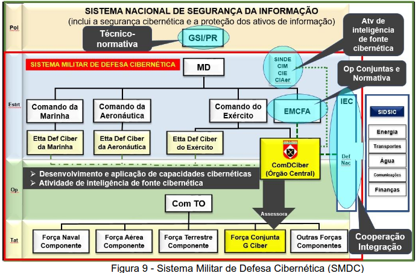

# Capítulo VIII - Comando de Defesa Cibernética

## Página 77

### 8.1 Considerações Iniciais

8.1.1 O Comando de Defesa Cibernética (ComDCiber) é um Comando Operacional Conjunto, permanentemente ativado e com capacidade interagências, pertencente à estrutura regimental do Exército Brasileiro. Tem como missão, respeitadas as competências das Forças Singulares e dos Comandos Operacionais ativados: planejar; orientar; coordenar; integrar; e executar atividades relacionadas ao desenvolvimento e à aplicação das capacidades cibernéticas, como órgão central e no âmbito do Sistema Militar de Defesa Cibernética (SMDC), a fim de contribuir para o uso efetivo do espaço cibernético, impedindo ou dificultando sua utilização contra os interesses da Defesa Nacional.

8.1.2 O ComDCiber participa da elaboração dos Planos Estratégicos de Emprego Conjunto das Forças Armadas (PEECFA), exerce as funções normais de Estado-Maior do Comando de Defesa Cibernética em operações e, ainda, cede pessoal para mobiliar as estruturas de defesa cibernética dos demais Comandos Operacionais ativados e do Comando e Estado-Maior da Força Conjunta de Guerra Cibernética, quando constituída.

8.1.3 As competências do ComDCiber estão reguladas em Portaria Normativa do Ministério da Defesa, que dispõe sobre o SMDC.

8.1.4 O SMDC é um conjunto de instalações, equipamentos, doutrina, procedimentos, tecnologias, serviços e pessoal essenciais para realizar ações voltadas para assegurar o uso efetivo do espaço cibernético pela Defesa Nacional, bem como impedir ou dificultar ações hostis contra seus interesses.

