# Principais Teóricos

## Antiguidade Clássica (c. 460–347 a.C.) 

| Teórico | Descrição | Frase / Obra Principal |
|----|----------|------------|-----------------|----------------|
| 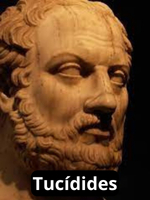 **Tucídides** (460–401 a.C.)| O **Estado** é o ator principal. O Estado é um ator unitário: ele age com **uma voz única**.  Os tomadores de decisão são **racionais**.  A guerra é causada pela mudança na distribuição de poder (o recrudescimento do poder de Atenas, gerou temor em Esparta, o que tornou a guerra inevitável.).  Considerado um **precursor do Realismo**.  preocupava-se com **questões de segurança** – a necessidade do Estado de se **defender dos inimigos, tanto externos como internos** | **“Os fortes fazem o que podem e os fracos sofrem o que devem.”**   📚 *História da Guerra do Peloponeso* |
| 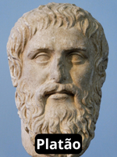 **Platão**(427–347 a.C.) |Filosofia Clássica / Influência para o Realismo/Radicalismo.  No “Estado perfeito”, os governantes devem ser **reis-filósofos** detentores de conhecimentos superiores de filosofia e guerra. A força vital humana é a **inteligência**.  Introduziu a <mark>**análise de classe**</mark> e o <mark>**raciocínio dialético**</mark>, que seriam bases futuras para os analistas **Marxistas (Radicalismo)**. | **“A justiça só é possível quando cada classe cumpre seu papel.”**  📚 *A República* |
| 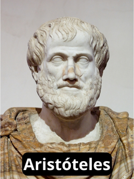 **Aristóteles** (384–322 a.C.) | Buscou um sistema político **internamente equilibrado**.  A ascensão e queda dos Estados resultam de **fatores internos**.  Analisou 168 constituições e defendeu o estudo comparado de constituições e o governo misto como ideal. *Filosofia Clássica / Empirismo Político* |  **“O homem é, por natureza, um animal político.”**  📚 *Política* |

## Período Medieval (c. 354–430 d.C.)

| Teórico | Descrição | Frase / Obra Principal |
|----------|------------|-----------------|----------------|
| 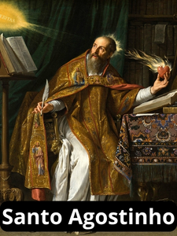 **Santo Agostinho** (354–430) |**Realismo**  Seis séculos após Tucídidesm, Sto Agostinho enxergava a humanidade como **falha, egoísta e egocêntrica**, embora não predestinada a ser assim  Atribuiu a culpa das guerras a essas características humanas fundamentais.  Embora realistas posteriores questionem a justificativa bíblica dada por Agostinho para a natureza falha e egoísta da humanidade, poucos põem em dúvida o fato de que os humanos são, em essência, **ávidos por poder e absortos em si mesmos**. | “todo ato é um ato de autopreservação da parte dos indivíduos.”  📚 A Cidade de Deus |

## Séculos XVI–XVII

| Teórico | Descrição | Frase / Obra Principal |
|----------|------------|-----------------|----------------|
| 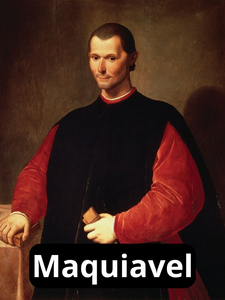 **Nicolau Maquiavel** (1469–1527) | O filósofo italiano Maquiavel aprofundou as implicações da **natureza falha da humanidade** para o Estado.   Ele é considerado um dos **Principais Teóricos do Realismo**.   Sua obra elucida as qualidades necessárias ao líder para assegurar a **força e a segurança do Estado**. Defende que o líder deve permanecer sempre **atento a ameaças** tanto à sua segurança pessoal quanto à do Estado, advertindo contra a **excessiva contenção**.  É lembrado por sua defesa do uso hábil de **alianças** e de estratégias ofensivas e defensivas para proteger o Estado. | **“O príncipe responsável deve estar preparado para tomar qualquer iniciativa, desde que tenha em vista a preservação do Estado.”**  📚 *O príncipe* |
| 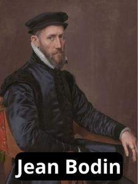**Jean Bodin** (1530–1596) | Filósofo francês que contribuiu para o desenvolvimento do conceito de **soberania**. A soberania é um conceito fundamental nas relações internacionais contemporâneas. Para Bodin, a soberania **não reside em um indivíduo, mas em um Estado**. Ele forneceu o arcabouço conceitual da soberania que emergiria dos Tratados de Vestfália (1648). A soberania, embora idealmente absoluta, é restringida pela lei divina, pela lei natural e pelas "leis constitucionais do reino". | **Soberania** era o **“poder absoluto e perpétuo investido em uma comunidade”**.  Soberania é a **“marca distintiva do soberano”**, que faz as leis para seus súditos e revoga as existentes. |
| 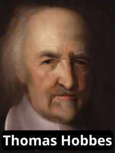**Thomas Hobbes** (1588–1679) | Filósofo político inglês. Suas ideias são centrais para o Realismo. Ele imaginou um **estado de natureza** (mundo sem autoridade governamental). Nesse estado, os seres humanos seriam governados por paixões e viveriam em constante incerteza quanto à sua segurança. Extrapolando para o nível internacional, na ausência de autoridade, a sociedade encontra-se em **“estado de natureza” ou anarquia**   Sistema Internacional é **Anárquico**. A solução para o dilema da guerra perpétua interna é o surgimento de um **Estado unitário – um Leviatã –** em que o controle do poder é centralizado e absoluto (Hegemonia). | **“Para Hobbes, a vida do Homem é solitária, egoísta e mesmo brutal.”**  Na anarquia internacional, a norma para os Estados é **“ter as armas apontadas e os olhos fixos uns nos outros”**.  📚 *O leviatã* |

## Século XVIII (Iluminismo)

| Teórico | Descrição | Frase / Obra Principal |
|----------|------------|-----------------|----------------|
| 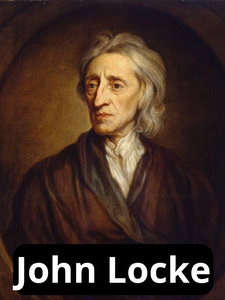**John Locke** (1632–1704) | Liberalismo (Fundamento) O Estado é uma instituição benéfica, criada por **homens racionais** para proteger seus **direitos naturais** (vida, liberdade e propriedade). Locke argumentou que o **poder político reside nas mãos do povo**, não do monarca, e o líder deriva sua legitimidade do **consentimento dos governados**. | *Dois tratados sobre governo* |
| 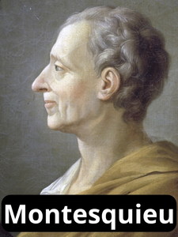**Montesquieu** (1689–1755) | Liberalismo (Otimismo Iluminista)  Expressa o **otimismo iluminista**. A **guerra é um produto da sociedade**, e não um atributo inerente aos indivíduos. A **educação é imprescindível** para superar os problemas da sociedade. Argumentava que em tempos de paz, cada nação deve fazer todo o bem que puder às demais. | Não há obra principal específica citada nas fontes, apenas a referência ao seu pensamento. |
| 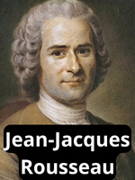 **Jean-Jacques Rousseau** (1712–1778) | Liberalismo (Contrato Social) / Radicalismo (Influência) Descreveu o **estado de natureza como egocêntrico**, onde a preocupação primária do homem é a autopreservação. Em contraste com Hobbes, ele vislumbrou uma solução diferente, preferindo a criação de **comunidades menores** por meio do **contrato social**. Nesses espaços, os indivíduos se unem sob a direção da **"vontade geral"** para cumprir o bem comum. Seu trabalho apresenta o **dilema do cervo e da lebre**, que questiona se os Estados visam a interesses de curto prazo ou reconhecem os benefícios do interesse comum. | *Discurso sobre a origem e os fundamentos da desigualdade entre os homens* |
| 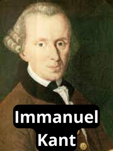 **Immanuel Kant** (1724–1804) | Base da Escola Idealista / Liberalismo (Fundamento da Paz Democrática) Postulou que a **anarquia internacional pode ser superada** por meio de **ação coletiva** (Homem: Egoísta, mas pode aprender universalismo). Vislumbrou uma **federação de Estados (repúblicas)** vinculadas pelo Estado de Direito para alcançar a paz perpétua (ordem federal é “superleviatã”). Argumentou que a disseminação da democracia mudaria a política internacional ao eliminar a guerra, pois o público, que arca com o ônus dos embates, seria cauteloso em apoiá-la (teoria da **Paz Democrática**). Não exigia atores morais; supunha que os Estados agiriam por interesse próprio, sendo levados a uma zona de paz em expansão, mesmo por "demônios racionais". | *Ideia para uma história universal*, *A paz perpétua* |
| 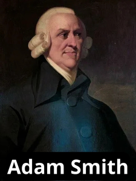 **Adam Smith** (1723–1790) | Liberalismo Econômico (Capitalismo) Argumentou que os indivíduos, ao buscarem seus próprios interesses, são guiados por uma **"mão invisível"** para o bem coletivo (aumento da riqueza). Deve-se permitir o **livre comércio**, sem regulamentações estatais excessivas. O livre comércio gera uma **interdependência** entre os Estados que **eleva o custo da guerra** e reduz sua probabilidade de ocorrência. | *Uma inquirição sobre a natureza e causas da riqueza das nações* (*A riqueza das nações*) |

## Século XIX e Início do Século XX

| Teórico | Descrição | Frase / Obra Principal |
|----------|------------|-----------------|----------------|
| 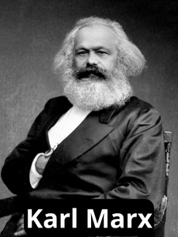**Karl Marx** (1818–1883) | Radicalismo / Marxismo Sua obra é **fundamental para todo o pensamento radical**. Baseou sua teoria na **mudança econômica e no conflito de classes econômicas**. No sistema capitalista, interesses privados controlam o trabalho, e a sociedade é dividida em duas classes econômicas: a **burguesia** (proprietária dos meios de produção) e o **proletariado** (mão de obra explorada). Prevê um **choque inevitável** entre essas classes, resultando na vitória do proletariado e no surgimento de uma nova ordem socialista. Presume a **primazia da economia** para explicar virtualmente todos os outros fenômenos. Para os radicais, o Estado é um **agente do capitalismo internacional** e o sistema internacional é **altamente estratificado**. | Não há obra principal específica citada nas fontes, mas seu pensamento está baseado em sua teoria sobre a evolução do capitalismo. |
| 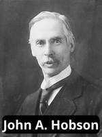 **John A. Hobson** (1858–1940) | Radicalismo **Condenava o imperialismo** como irracional, arriscado e potencialmente conflituoso, embora não o visse como necessariamente inevitável. Teorizou que a expansão imperialista é impulsionada por **três condições nos Estados mais desenvolvidos**: **superprodução** de bens e serviços, **subconsumo** (devido aos baixos salários das classes mais baixas) e **excesso de poupança** pelas classes mais altas. A expansão para o exterior visa resolver esses problemas econômicos, encontrando novos mercados e mantendo baixos os salários internos. | Não há obra principal específica citada nas fontes. |
| 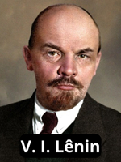 **V. I. Lênin** (1870–1924) | Radicalismo / Marxismo Para Lênin e outros marxistas, o problema capitalista não é de demanda insuficiente, mas de **taxas decrescentes de retorno sobre o capital**. Postulava que o **Imperialismo** é a **busca inevitável de novas fontes de matérias-primas** e, portanto, **necessariamente resulta em guerra** entre Estados capitalistas pelo controle de regiões em desenvolvimento. Os Estados capitalistas dependem de mercados e recursos externos devido à sua distribuição desigual. | Não há obra principal específica citada nas fontes, mas as fontes mencionam sua reinterpretação do Marxismo ligando o imperialismo à guerra. |
|  **Woodrow Wilson** (1856–1924) | Idealismo / Liberalismo Foi o principal propositor do **idealismo wilsoniano** no século XX. Sua premissa básica era que a **guerra pode ser evitada por meio da ação coletiva dos Estados**. Defendeu a **autodeterminação** para grupos nacionais, a **diplomacia aberta** e a **remoção de barreiras econômicas** entre as nações para manter a paz. Propôs uma ordem internacional assegurada pela **Liga das Nações**, baseada na **segurança coletiva** (agressão de um Estado seria combatida pela reação coletiva automática). | **Pacto da Liga das Nações** (faz parte dos seus Quatorze Pontos). |
| 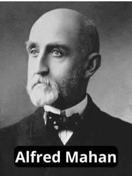 **Alfred Mahan** (1840–1914) | Realismo (Geopolítica Naval) Escreveu sobre a importância do **controle dos mares**. Sua tese era de que o Estado que controla as **rotas marítimas** controla o mundo. Para ele, a soberania em terra não era tão crítica quanto o acesso e o controle das rotas oceânicas. | Não há obra principal específica citada nas fontes, mas o foco está em seus escritos sobre o controle dos mares. |
| 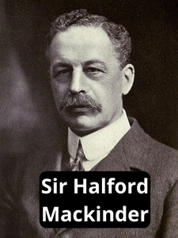 **Sir Halford Mackinder** (1861–1947) | Realismo (Geopolítica Terrestre)  Enfatizou a importância do **controle do “coração” geográfico da Eurásia** (*Heartland*). Sua tese postula que **"Quem domina a Europa Oriental domina o coração da Eurásia; quem domina o coração da Eurásia comanda a ilha mundial da Europa, Ásia e África, e quem comanda a ilha mundial comanda o mundo"**. Suas ideias se encaixam na tradição realista, que considera o tamanho e a posição geográfica como fontes naturais primárias de poder. | Não há obra principal específica citada nas fontes. |
| 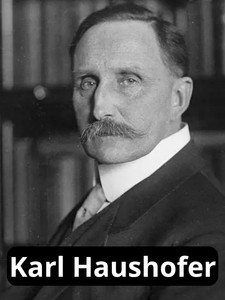 **Karl Haushofer** (1869–1946) | Realismo (Geopolítica - Aplicada) Geógrafo alemão que interpretou a tese de Mackinder para defender a expansão nazista. Defendia que a Alemanha poderia se tornar uma potência se conseguisse capturar o **coração da Eurásia**. Sua obra buscou fazer da geopolítica uma área legítima de investigação acadêmica e ele foi o principal proponente da expansão nazista. | Não há obra principal específica citada nas fontes. |

##  Pós-Segunda Guerra Mundial (Realismo Clássico)
**George Kennan** (1904–2005) | Realismo | Arquiteto da política de **Contenção**. Baseou sua análise no equilíbrio de poder, buscando impedir a expansão soviética e evitar a guerra. | Artigo “X”. | Sua tese foi a pedra angular da política externa dos Estados Unidos durante a Guerra Fria.

**Hans Morgenthau** (1904–1980) | Realismo Clássico | A política internacional é caracterizada como uma **luta por poder**. O **interesse nacional** é definido em termos de poder. A moralidade é determinada pelas consequências políticas. | *Política entre nações*. | Sua obra sintetizou o Realismo, tornando-o a teoria dominante pós-Segunda Guerra Mundial, em contraste com o Idealismo anterior.

## **Pós-Guerra Fria (Neorrealismo)

**Kenneth N. Waltz** (1924–2013) | Neorrealismo / Realismo Estrutural | Dá primazia à **estrutura do sistema internacional** como fator explanatório (anarquia e distribuição de poder/polaridade). Argumenta que a **bipolaridade** é a estrutura mais estável. Anarquia é a dinâmica nuclear. | *Teoria das relações internacionais*, *O homem, o Estado e a guerra*. | Criou o Neorrealismo, simplificando o Realismo clássico e conferindo-lhe maior rigor teórico. Influenciou a análise do sistema internacional em termos de polaridade (multi/bi/uni). |

**Robert Gilpin** (1930–) | Realismo (Ciclos Hegemônicos) | Examina ciclos de ascensão e queda de potências dominantes. A decadência do Estado hegemônico é causada por fatores econômicos (custos de império, declínio de investimento, difusão de tecnologia). | *War and Change in World Politics*. | Uma reinterpretação realista que introduz a dinâmica cíclica da mudança sistêmica, focando no poder econômico. |

## Pós-Guerra Fria (Neoliberalismo)

**R. Keohane** (1941–) e **J. Nye** | Institucionalismo Neoliberal / Liberalismo | O sistema internacional é **interdependente**. Os Estados cooperam em anarquia porque a **interação contínua** torna a colaboração racional (**dilema do prisioneiro repetido**). As **instituições** facilitam a cooperação, reduzem custos de transação e fraude, e ampliam o fluxo de informações. | *Poder e interdependência*. | Renascimento do Liberalismo pós-1970. Sua visão contrasta com o pessimismo realista sobre a cooperação, ao focar nos ganhos mútuos absolutos (em vez de ganhos relativos).

## Pós-Guerra Fria (Radicalismo)

**Teóricos da Dependência** (Ex: Prebisch, Faletto, FHC) | Radicalismo / Teoria da Dependência | A estrutura internacional é hierárquica e exploradora. As **Corporações Multinacionais (CMNs)** e bancos são agentes de penetração que mantêm as relações de dependência. Estados periféricos (Sul) têm poucas opções, cooptados pelas elites internas. | N/A | Base do pensamento radical latino-americano. Concentra a análise na **estratificação** econômica do sistema, causada pelo capitalismo.

## Pós-Guerra Fria (Behaviorismo / Método Científico)

J. David Singer (1925–2009)

Cientista político que, junto com Melvin Small, iniciou o projeto Correlatos da Guerra (Correlates of War - COW) a partir de 1963.

Fundamental para o desenvolvimento da abordagem behaviorista e quantitativa nas RI. Sua motivação era a preocupação filosófica normativa: como conquistar a paz?.

## Pós-Guerra Fria (Pós-Modernismo / Abordagens Alternativas. )

Cynthia Weber

Sua análise de soberania desafia o entendimento convencional de filósofos tradicionais.

Pesquisadora que trabalha com a desconstrução de conceitos básicos, como a soberania, mostrando que suas conceituações estão em constante mutação, de acordo com as exigências do momento.

## Pós-Guerra Fria (Construtivismo)

**Alexander Wendt** (1958–) | Construtivismo | A realidade não tem significado fixo ou inerente; o significado é **construído socialmente através da interação** (discurso). **"Anarquia é o que os Estados fazem dela"**. Identidades e interesses dos Estados são maleáveis e transformáveis por meio de normas e ideias. | *Social Theory of International Politics*. | Estabelece uma ruptura com o materialismo do Realismo e Liberalismo, focando no **poder das ideias, da cultura e da linguagem** (poder discursivo). |

## Teóricas Feministas

(Ex: Tickner, Enloe, Sylvester) | Feminismo (Crítica) | O discurso teórico é dominado por uma perspectiva masculina. O poder deve ser definido como capacidade de agir em **consonância e conexão** (não apenas dominação e autonomia). Questionam o conceito de "ameaça". | N/A | Vertente crítica que questiona as premissas masculinas do Realismo clássico e buscam um olhar mais humanista para a segurança e a saúde mundial. |

Christine Sylvester

Sua investigação foca em encontrar as vozes dos "outros", daqueles indivíduos marginalizados nas relações internacionais.

Stephen Walt (1955–)

Cientista político que enfatiza que nenhuma perspectiva sozinha pode captar a complexidade da política mundial contemporânea e defende que "é bem melhor dispormos de um conjunto diversificado de ideias concorrentes".

Teoria das Relações Internacionais (Meta-Teoria). Sua citação é usada para justificar a necessidade de se estudar múltiplas abordagens teóricas (realismo, liberalismo, radicalismo, construtivismo).