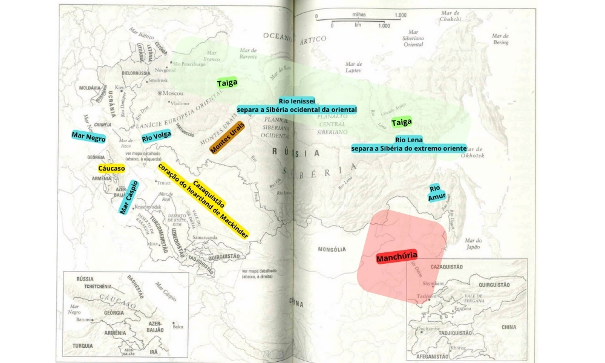

# CAPÍTULO X - A RÚSSIA E O HEARTLAND INDEPENDENTE

Pág 157

**Alexander Soljenítsin**📌 inicia seu romance épico sobre a Primeira Guerra Mundial, Agosto de 1914, com uma rapsódia sobre a cordilheira do Cáucaso, em que “cada reentrância, (...) de um branco fúlgido com reflexos de um azul profundo, (...) erguia-se tão vasta acima das mesquinhas criações humanas, tão elementar em um mundo artificial, que mesmo que todos os homens que viveram em todos os milênios passados abrissem os braços o mais que pudessem e carregassem tudo o que já houvessem criado (...) e amontoassem tudo em gigantescas pilhas, jamais conseguiriam erguer uma cadeia de montanhas tão fantástica quanto o Cáucaso”. Soljenítsin prossegue nesse espírito, escrevendo sobre as “vastidões nevadas”, os “penhascos nus”, “talhos e nervuras” e “fragmentos vaporosos, indistinguíveis das nuvens de verdade”.¹

Ao longo da História, o **Cáucaso inspirou nos russos**, sobretudo nos nacionalistas mais aguerridos, como Soljenítsin, temor e reverência. Aqui, entre os mares Negro e Cáspio, encontra-se um istmo no qual a Europa vai, pouco a pouco, desaparecendo em meio a uma massa de montanhas com 1000 quilômetros de comprimento e passando dos 5000 metros de altitude — hipnótica em sua beleza cintilante, sobretudo depois da extensão plana e monótona das estepes ao Norte. Esse é o faroeste russo, embora as montanhas situem-se ao Sul de Moscou e São Petersburgo. Aqui, desde o século XVII, <u>colonos russos tentam subjugar uma variedade de povos orgulhosos: tchetchenos, inguches, ossetas, daguestaneses, abecazes, kartvelianos, kakhetianos, armênios, azeris e outros</u>. Aqui, os russos defrontaram-se com o Islã tanto em sua moderação quanto em sua implacabilidade. A complexa reação emocional dos russos à existência do Cáucaso, que ao mesmo tempo os tantaliza e ameaça, abre uma janela para a história russa como um todo.

## Rússia - Potência Terrestre

A Rússia é a mais proeminente **potência terrestre do mundo**, estendendo-se por 170 graus de longitude, quase metade da circunferência do globo. <u>Sua principal via de acesso ao mar é pelo Norte, que, porém, encontra-se bloqueado pelo gelo ártico durante vários meses do ano</u>. **As potências terrestres vivem em permanente insegurança**, como **Mahan**📌 previa. Sem mares que as protejam, atormenta-as a insatisfação constante, que as obriga a se expandir de maneira contínua se não quiserem ser, por sua vez, conquistadas. É o caso especialmente dos russos, <u>cujo território plano é quase desprovido de fronteiras naturais e proporciona pouca proteção. Seu temor de uma invasão por terra é um dos temas centrais de</u> **Mackinder**📌. Com efeito, os <u>russos avançaram sobre o Centro e o Leste Europeus</u> a fim de cortar o caminho da **França do século XIX** e da **Alemanha do século XX**. <u>Marcharam sobre o Afeganistão</u> para fazer frente aos **britânicos na Índia** e buscar acesso às águas mais quentes do Oceano Índico, e expandiram-se para o Extremo Oriente a fim de **bloquear a China**. Quanto ao Cáucaso, essas montanhas constituem a barreira que os russos têm de dominar a fim de se protegerem das irrupções políticas e religiosas do Grande Oriente Médio.

Outro fato geográfico a respeito da Rússia é o frio severo. A parte mais setentrional dos Estados Unidos localiza-se no paralelo 49 de latitude norte, onde começa o Canadá. Contudo, a grande massa do território russo encontra-se a Norte do paralelo 50, de modo que a população do país habita um clima ainda mais gélido do que a canadense, que se concentra ao longo da fronteira americana. “Devido à latitude, à distância de mares abertos, às barreiras impostas pelas montanhas e à continentalidade”, escreve o geógrafo **Saul Cohen**📌, <u>“o clima russo torna o país frio e árido demais para a habitação permanente e em larga escala.</u>

O Cáucaso, entretanto, bem como os trechos do Extremo Oriente russo próximos à fronteira com a Coreia do Norte, constitui a exceção a esse princípio — de modo que outro atrativo da região são as temperaturas relativamente amenas do paralelo 43. De fato, o clima e a paisagem da Rússia são extremamente inóspitos, e aí se encontra a chave tanto do caráter dos russos quanto de sua história.

A intensidade do frio parece ter desenvolvido nos russos <u>“uma capacidade para o sofrimento, certo **comunalismo**, mesmo uma disposição a sacrificar o indivíduo pelo bem comum”</u>, escreve o historiador da Rússia 📌**Philip Longworth**, que explica que a curta estação de cultivo das altas latitudes setentrionais impunha “uma interdependência entre os agricultores”, bem como um “esforço frenético e extenuante, horas intermináveis de trabalho nos campos e mobilização das crianças”; já que tanto a semeadura quanto a colheita tinham de ser levadas a cabo às pressas. Além disso, o fato de o frio não permitir maiores excedentes incentivava as elites do emergente Estado russo a procurar adquirir o controle de áreas mais amplas e eliminava todo e qualquer estímulo para que os lavradores se empenhassem mais de maneira espontânea, contribuindo para uma “tendência à violência” no dia a dia.⁴ Tanto o comunismo russo quanto um certo desdém em relação à liberdade pessoal em vigor até pouco tempo atrás, tiveram suas raízes na frigidez da paisagem. A limpeza do terreno, a construção de igrejas e fortificações na planície gelada e a cantilena das orações ortodoxas pressagiavam, todos, um comunalismo pungente.

O cinturão Norte da Rússia, entre o Círculo e o Oceano Árticos, <u>caracteriza-se pela **tundra congelada** e **sem árvores**, coberta de musgo e líquens</u>. Quando ela derrete, no verão, a neve meio liquefeita cobre de uma lama suja a terra, que fica infestada de mosquitos gigantescos. Ao Sul da tundra, ocorre a **taiga**, **maior floresta de coníferas do mundo, que se estende do Báltico ao Pacífico**. Na Sibéria e no Extremo Oriente russo, cerca de 40% dessas regiões são cobertas de **permafrost.** Por fim, no Sul da Rússia, estendendo-se desde a planície húngara, a Oeste, e passando pela Ucrânia, Cáucaso do Norte e Ásia Central até chegar à distante Manchúria, <u>há as estepes, maior área de campinas do mundo, **“a grande estrada de grama”**</u>, nas palavras do especialista em Rússia **W. Bruce Lincoln**📌. Como escreve Mackinder, os russos, originalmente, não passavam de um povo amontoado no abrigo protetor da floresta; e, a fim de garantir a própria segurança, precisou lançar-se à conquista — da Alta Idade Média até os primórdios da era moderna — dos nômades asiáticos das estepes que vinham do Sul e do Leste. Em especial, a prolongada e humilhante **presença dos mongóis** (a **Horda Dourada**, perto da Moscóvia medieval, e a **Horda Azul**, na Ásia Central), <u>um dos principais fatores responsáveis por negar à Rússia a experiência do Renascimento</u>, conferiu aos ortodoxos orientais eslavos por eles fustigados algo em comum — um vigor e um propósito que seriam cruciais para torná-los capazes de **insurgir-se contra o jugo tártaro** e, nos séculos mais recentes, amealhar vastas extensões de território.⁶ O jugo tártaro, segundo o historiador  **G. Patrick March**📌, <u>instilou nos russos **“maior tolerância à tirania”**, ao mesmo tempo habituando-os às privações e afligindo-os com um **“medo paranoico de invasões”**.</u>

## Emoção Nacional Russa Quintessencial

Página 162 

A insegurança é a **emoção nacional russa quintessencial. “A ânsia por encontrar na História ao mesmo tempo raízes e justificativa decorre, em parte, da insegurança inerente à Planície Oriental”,** escreve **James H. Billington**📌, diretor da Biblioteca do Congresso americano, em sua obra capital sobre a cultura russa, The Icon and the Axe. “É a geografia, não a História”, diz ele, que veio a dominar o pensamento russo:

Ciclos sazonais inóspitos, uns poucos rios esparsos e padrões acanhados de chuvas e fertilidade do solo controlavam a vida do camponês comum; e as ondas de conquistadores nômades em geral não ser mais que o ir e vir de objetos na superfície de um mar imutável e hostil.

Em outras palavras, <u>a própria planura da Rússia, com sua extensão da Europa ao Extremo Oriente quase destituída de qualquer fronteira natural</u> e a tendência a configurar-se mais em povoados dispersos do que em concentrações urbanas, por longos períodos induziu a um **cenário de anarquia**, em que a **insegurança permanente** impunha-se a todos os grupos.

Encurralados nas florestas, com seus inimigos emboscados nas estepes, os russos refugiaram-se tanto no animismo quanto na religião. O festival primaveril da Páscoa ortodoxa “revestiu-se de particular intensidade no Norte russo”, observa **Billington**📌. A tradicional saudação de Páscoa “era não o inócuo ‘Feliz Páscoa’ do Ocidente moderno, mas uma afirmação direta do fato central da história sagrada, ‘Cristo elevou-se!’”; e a resposta era “Elevou-se, de fato!” – o que falava não só do Cristo que ascendeu aos céus, mas também da natureza, na medida em que o inverno longo e sombrio encontrava-se quase no fim, com a neve caindo dos galhos das árvores e o brotamento das folhas novas. O cristianismo ortodoxo oriental encerra mais que uma fagulha de paganismo. E o comunismo russo, com sua ênfase bolchevique na totalidade, não passou de mais uma forma da religião nacional – o equivalente secular da ortodoxia, de acordo com o intelectual russo do início do século XX Nicolas Berdyaev. Como revela o título do livro de **Billington**📌, o ícone constituía um vívido lembrete ao atormentado habitante de fronteira do poder de sua fé ortodoxa, bem como a segurança e o elevado propósito por ela conferidos, ao passo que o machado “era o implemento básico da Grande Rússia: o meio indispensável para subordinar a floresta” a seus próprios fins.

A totalidade religiosa e comunista da Rússia, em outras palavras, remontava a essa sensação de desamparo nas matas junto às estepes, que, por sua vez, inculcou nos russos a necessidade da conquista. No entanto, sendo suas terras planas e, em sua imensidão, integralmente conectadas à Ásia e ao Grande Oriente Médio, a Rússia em si foi conquistada. <u>Enquanto outros impérios viveram um período de ascensão, expansão e colapso – para deles nunca mais se ouvir falar, o **Império Russo expandiu-se, ruiu e renasceu vezes sem conta**</u>. A geografia e a História demonstram que não se pode jamais menosprezar a Rússia. Seu parcial ressurgimento em nosso próprio tempo, após a dissolução do Império Soviético, é parte integrante de uma longa história.

O **primeiro grande império da Rússia** (e, a rigor, o primeiro grande corpo político do Leste Europeu) foi o **Principado de Kiev**, que despontou em meados do século IX em Kiev, a mais meridional das cidades históricas ao longo do Rio Dnieper — o que permitiu ao Principado de Kiev entabular um contato regular com o **Império Bizantino**, ao Sul, facilitando a conversão dos russos ao cristianismo ortodoxo. Este, como vimos, seria enriquecido pela intensidade particular que os russos, a partir de seu próprio encontro com uma paisagem invernal, lhe conferiram. A geografia decretou também que o Principado de Kiev se constituísse, em termos demográficos, num misto de vikings escandinavos (ali chegados pelos rios que desaguavam no Norte) e os eslavos orientais nativos da região. A pobreza dos solos locais impôs a necessidade de conquistar tratos de terra mais amplos a fim de assegurar o suprimento de víveres — e assim começou a se delinear um império que reuniu duas forças regionais dinâmicas, vikings e bizantinos. A Rússia, como conceito geográfico e cultural, nasceu daí.

O Principado de Kiev vivia em luta permanente contra os nômades das estepes. Em meados do século XIII, seria finalmente devastado pelos mongóis comandados por Batu Khan, neto de Gêngis. Sucessivos anos de seca em suas terras de pastagem tradicionais haviam impelido os mongóis rumo ao Ocidente, em busca de novos pastos para seus cavalos, sua fonte tanto de alimento quanto de mobilidade. Assim, a primeira grande tentativa de expansão imperial russa no coração da Eurásia foi destruída.

## Ivan IV, “o Terrível”

Em consequência, mediante um sem-número de movimentos e contramovimentos e dramas políticos que foram fruto da agência humana, a história russa foi paulatinamente se deslocando para o Norte, para cidades como Smolensk, Novgorod, Vladimir e Moscou, tendo sido esta a que despontou com maior força nos séculos finais da Idade Média. Se o período medieval, como vimos, caracterizou-se pela autocracia e paranoia, em parte em decorrência da pressão exercida pelos mongóis, a ascensão de Moscou à posição de proeminência foi favorecida por sua posição vantajosa para o comércio — em plena rota de transporte de embarcações por terra entre os rios da bacia do Médio e do Alto Volga. Bruce Lincoln escreve: “Moscou erguia-se no centro do planalto onde nasciam os grandes rios da Rússia europeia (...); constituiu-se em um eixo a partir do qual as grandes vias fluviais russas se espraiavam como os raios irregulares de uma roda amassada.”¹¹ Entretanto, como nessa fase de sua história os russos evitavam as estepes por onde os tártaros vagavam, concentraram-se em aprofundar o desenvolvimento das impenetráveis extensões de floresta, onde um Estado melhor manteria a coesão.¹² A Moscóvia medieval era cercada e praticamente não tinha acesso ao mar. A Leste, havia apenas taiga, estepes e mongóis. Ao Sul, os turcos e os mongóis das estepes negavam-lhe uma saída para o Mar Negro. A Oeste e Noroeste, suevos, poloneses e lituanos bloqueavam-lhe a passagem até o Mar Báltico. Ivan IV, “o Terrível” (1553–1584), tinha acesso a uma única orla marítima, de utilização quase impraticável, no Norte longínquo: o Mar Branco, uma enseada do Oceano Ártico. Ameaçados por todos os lados da planície infinita, os russos não tinham outra escolha senão tentar romper o cerco, o que aconteceria sob Ivan IV.

Ivan, o Terrível é uma figura histórica controversa, ao mesmo tempo monstro e herói folclórico, cuja alcunha é uma tradução equivocada de Groznyi, “Pavoroso”, que lhe foi atribuída por correligionários seus, devido aos seus métodos de punição dos culpados. Ivan demonstrou que, em sua época e seu lugar, o único antídoto ao caos era o absolutismo. Foi o **primeiro grande imperialista da Rússia**, papel que lhe foi imposto, em parte, pela História e pela geografia. Em 1453, a Bizâncio grega foi devastada pelos turcos otomanos, e os refugiados de Constantinopla afluíram ao Norte, onde se abrigaram em Moscou, levando consigo os conhecimentos políticos, militares e administrativos cruciais para a construção de um império. **Ivan, ao tornar-se czar, derrotou os tártaros de Cazã**,* o que lhe conferiu acesso aos Urais; mais tarde, deu um passo fundamental rumo à conquista da Sibéria ao derrotar os mongóis do canado de Sibir, próximo ao Rio Irtich, a Noroeste da Mongólia atual. A crueldade e astúcia de Ivan eram uma síntese do que seu povo havia aprendido ao longo de gerações de “paciência e flexibilidade no lidar” com os asiáticos. A rapidez da irrupção russa sobre essa vasta paisagem foi tamanha que, menos de seis décadas depois, no começo do século XVII, os russos estavam no Mar de Okhotsk, às margens do Oceano Pacífico.

Ivan visava também ao Sul e ao Sudeste, especialmente o canado muçulmano de Astracã, uma ramificação da Horda Dourada que dominava o estuário do Volga e as estradas que levavam ao Cáucaso, à Pérsia e à Ásia Central. Era a terra da Horda Nogai, nômades turcomanos que falavam uma forma de kipcthak. Embora os Nogai fossem inimigos políticos de Moscóvia, comerciavam com o principado, e viram com bons olhos a manutenção da segurança das estradas principais pelas tropas de Ivan. O mar de campinas era uma complexa vastidão em que mongóis e tártaros, cujos exércitos às vezes se sobrepunham, guerreavam – e também comerciavam – com os russos. E, não nos esqueçamos, por mais duras e complicadas que fossem as planícies, a Cordilheira do Cáucaso era pior – o que a tornava, portanto, mais exótica aos olhos russos e explicava sua obsessão por ela.

Ivan era infatigável. Impulsionado por sua vitória no Sul, partiu para a guerra na região das atuais Estônia e Letônia a fim de assegurar um bastião no Báltico, mas foi derrotado por uma aliança entre a Liga Hanseática e a Ordem Livoniana germânica, o que levaria a um crucial isolamento da Rússia em relação ao Ocidente no momento em que o país sofria a influência de suas terras recém-conquistadas no Oriente Médio e na Ásia.

<u>A primeira investida russa no sentido de um império continental, em fins do século XVI e princípios do XVII, estabeleceu a **reputação dos cossacos**, empregados pelo Estado russo na consolidação de sua posição no Cáucaso</u>. Embora a palavra “cossaco”, ou cazaque, originalmente se referisse a mercenários tártaros, os cossacos vinham a ser indivíduos russos, lituanos e poloneses que, desesperados com as condições precárias que encontravam nas grandes propriedades rurais de suas pátrias, migraram para as estepes ucranianas – onde, em meio às condições caóticas de uma antiga fronteira mongol, sobreviviam como ladrões, mercadores, colonos e mercenários. Gradualmente, foram constituindo unidades irregulares do exército de Ivan por serem aguerridos e custarem pouco; assim, surgiram povoados cossacos nos vales dos rios, sobretudo do Don e do Dnieper. Aliás, o clássico *Taras Bulba*, de **Nikolai Gogol**📌, publicado inicialmente em 1835 e com uma versão final uma década depois, é uma história dos cossacos do Dnieper. Gogol era um nacionalista russo, mas considerava como **Rússia verdadeira e primordial a Ucrânia (palavra que significa “terra de fronteira”)**, cujas estepes desimpedidas e intermináveis – desprovidas de limites naturais e irrigadas por um número relativamente pequeno de rios navegáveis – haviam tornado beligerantes seus povos em constante conflito. Embora Gogol usasse as palavras “russo”, “ucraniano”, e “cossaco” para denotar identidades específicas, reconhecia também que estas se sobrepunham (como ainda acontece com as identidades locais). A narrativa de Gogol é sombria, recheada de uma violência sem redenção; e, por mais que a absoluta falta de humanidade retratada em suas páginas seja obra de indivíduos fazendo suas próprias escolhas terríveis, é igualmente verdade que a violência de Taras Bulba é, ao menos em parte, uma expressão da geografia das estepes russas e ucranianas, onde a horizontalidade, a continentalidade e as rotas de migração acarretam conflitos e rápidas mudanças de rumo.

O império de Ivan IV continuou se expandindo sob o comando de Boris Godunov (1598–1605), sobretudo na direção Sudeste de Stalingrado, dos Urais e das estepes cazaques. Todavia, chegou o momento da queda da Moscóvia medieval, do mesmo modo como o Principado de Kiev havia ruído antes dela – dessa vez com suevos, poloneses, lituanos e cossacos disputando seus despojos. <u>A Moscóvia medieval se autointitulava de a ***“Terceira Roma”***, legítima sucessora da própria Roma e de Constantinopla; seu desaparecimento, pois, a que se seguiu o chamado Tempo de Dificuldades – resultado do sectarismo reinante na capital – causou a impressão de que um mundo e uma civilização inteiros estavam chegando ao fim</u>. Entretanto, a Rússia não estava acabada, apesar das aparências na época. Poucos anos mais tarde, em 1613, **Miguel Romanov** subiu ao trono como czar, dando início a uma nova dinastia e um novo capítulo na história russa.

## Dinastia Romanov

Foi a dinastia Romanov que veio a definir a **Rússia moderna**, trazendo mecanização e maior organização administrativa para o imperialismo russo, um avanço em relação ao caráter relativamente romântico e improvisado das pilhagens da Moscóvia medieval. <u>Durante os 300 anos de reinado dos Romanov, a Rússia subjugou a Polônia e a Lituânia, destruiu a Suécia, humilhou a França napoleônica, reconquistou a Ucrânia, expandiu-se para a Crimeia e os Bálcãs, em detrimento dos turcos otomanos, ampliou e formalizou seu domínio sobre o Cáucaso, a Ásia Central e a Sibéria, chegando até a China e o Pacífico – além de recuperar-se dos reveses nas **Guerras da Crimeia (1853–1856)** e **Russo-Japonesa (1904–1905)**</u>. E, em consonância com o tema geral da história russa – expansões momentosas e recuos igualmente devastadores, contra o pano de fundo de uma geografia vasta e desobstruída –, em 1812 os Romanov perderam a Polônia e a porção mais ocidental da Rússia para o Grande Armée de Napoleão, apenas para recuperar-se em algumas semanas e impingir aos franceses uma retirada para a Europa Central que reduziu as forças inimigas a cinzas.

**Pedro, o Grande**📌, que <u>governou a Rússia entre fins do século XVII e princípios do XVIII, foi para a dinastia Romanov o que Ivan IV havia sido para a Moscóvia medieval: um indivíduo extraordinário cujos atos demonstram que a geografia é apenas uma parte da história.</u> Naturalmente, Pedro ficaria mais conhecido na História pela **construção de São Petersburgo**, às margens do Báltico, iniciada por ele em 1703 e que <u>motivou uma guerra extenuante contra o Império Sueco, no curso da qual a Suécia encetaria uma invasão via Lagos Masurianos e Bielorrússia e os russos queimariam sua safra como parte de uma política de terra arrasada nas regiões mais áridas, tática que voltariam a usar contra Napoleão e contra Hitler</u>. Não obstante, a grande realização de Pedro – a consolidação do litoral báltico russo, com o estabelecimento de uma nova capital voltada para a Europa, na tentativa de modificar a identidade política e cultural do país – acabaria fracassando. <u>As demais conquistas, em todas as outras direções</u>, fizeram a Rússia continuar sendo, sem sombra de dúvida, **o arquétipo do país eurasiano**; o único nessa situação, aliás, a despeito de seus esforços para assumir um caráter europeu, enquanto a geografia e uma história de invasões (exemplificadas pela mongol) negavam-lhe tal status. Nas palavras de **Aleksandr Herzen**📌, grande literato russo do século XIX:

""Até hoje, lançamos para os europeus e a Europa o mesmo olhar que lançam os provincianos para os habitantes da capital – com deferência e um **sentimento de nossa própria inferioridade**, dobrando-nos a eles e imitando-os, e assumindo como um defeito tudo aquilo em que diferimos.""

Todavia, os russos não tinham nada do que se envergonhar, pois podiam apenas ser o que eram de fato: um povo que havia arrancado um império de uma paisagem continental impossível e por isso, agora, batia às portas do Levante e da Índia e representava uma ameaça aos impérios francês e britânico – pois, mais ou menos na mesma época em que Herzen escreveu as palavras anteriores, as forças russas tomaram Tashkent e Samarcanda, no antigo Caminho da Seda para a China, próximos às fronteiras do subcontinente indiano.

<u>Enquanto os impérios marítimos da França e da Grã-Bretanha depararam-se com inimigos implacáveis no além-mar, os russos enfrentaram os seus dentro de seu próprio território: desde cedo, muito cedo aprenderam a manter-se ansiosos e vigilantes</u>. Constituíram uma nação que, de uma maneira ou de outra, esteve sempre em guerra; e, mais uma vez, o Cáucaso forneceu um exemplo vívido, <u>sob a forma dos tchetchenos muçulmanos da Ciscaucásia, que enfrentaram os exércitos de **Catarina, a Grande**📌</u> no fim do século XVIII e continuaram fazendo frente a sucessivos czares ao longo de todo o século XIX, numa disputa que prossegue em nosso próprio tempo – muito depois de áreas mais dóceis do Cáucaso mais ao Sul, como a Geórgia, já terem caído sob o controle czarista. A beligerância tchetchena foi fruto tanto da dificuldade de se extrair a subsistência do solo pedregoso das montanhas quanto da necessidade de pegar em armas para proteger carneiros e cabras dos predadores selvagens. Em virtude das rotas comerciais que atravessavam o Cáucaso, os tchetchenos tornaram-se ao mesmo tempo guias e bandoleiros. E, embora convertidos ao sufismo, um ramo em geral menos fanático do Islã, mostravam-se zelosos na defesa de sua terra natal em relação aos cristãos ortodoxos russos. No Cáucaso, escreve o geógrafo **Denis J. B. Shaw**📌, *“os colonos russos, ucranianos e cossacos do **‘império povoador’** entraram em choque com a resistência combativa dos povos montanheses – muitos dos quais, à exceção da maioria de ossetas, são de cultura islâmica, o que só veio reforçar sua determinação a combater o invasor russo”*. Devido ao seco rechaço do espírito independente da gente do Norte do Cáucaso, os bolcheviques recusaram-se a incorporá-los em uma república única e dividiram-nos para depois reintegrá-los em unidades artificiais que não se conformavam aos seus padrões linguísticos e étnicos. Assim, prossegue Shaw, “cabradianos e balkares foram reunidos, muito embora os primeiros tivessem mais em comum com os circassianos e os segundos, com os carachais”. Além disso, Stalin exilou na Ásia Central, em 1944, os tchetchenos, inguches e calmucos, por sua alegada colaboração com os alemães.

O Cáucaso em muito contribuiu para tornar dura a face do imperialismo russo. Como eu disse, esse foi com frequência o destino das potências terrestres, com sua recorrente necessidade de conquistar.

## Destino Manifesto

Assim, a pressão russa continuou, inspirando Mackinder a formular sua <u>**teoria do pivô** a partir de um surto de construção de ferrovias no país na segunda metade do século XIX: 25.000 quilômetros de linhas instaladas entre 1857 e 1882, que conectaram Moscou à fronteira prussiana</u>, a Oeste, e a Nijni Novgorod, a Leste, bem como à Crimeia, às margens do Mar Negro, ao Sul. Ademais, entre 1879 e 1886, os engenheiros russos abriram uma estrada de ferro ligando Krasnovodsk, na costa oriental do Cáspio, a Merv, mais de 800 quilômetros a Leste, próximo à fronteira da Pérsia e do Afeganistão; em 1888, seus trilhos haviam se estendido por mais quase 500 quilômetros a Nordeste, chegando a Samarcanda. (E foi construída uma ramificação de Merv rumo ao Sul, até quase a fronteira afegã.) Esses novos artérios ferroviários sucederam os avanços militares russos nos desertos de Karakum (“Areia Negra”) e Kyzyl Kum (“Areia Vermelha”), ao Sul das estepes centro-asiáticas, onde hoje encontramos o Turcomenistão e o Uzbequistão. Em virtude da proximidade do subcontinente indiano, onde o poderio britânico encontrava-se então em seu ápice, <u>essa investida imperial russa integrou-se ao **“Grande Jogo” disputado entre Rússia e Grã-Bretanha** pelo controle da Ásia</u>. Nesse ínterim, era aberta outra linha conectando Baku, na margem ocidental do Cáspio, a Batumi, no Mar Negro, transpondo, assim, o Cáucaso. E, em 1891, os russos iniciaram uma ferrovia ligando os Urais ao Pacífico, a 6,5 mil quilômetros de distância, atravessando a Sibéria, o Extremo Oriente e todas as florestas, todas as montanhas, todos os alagados e o permafrost que havia no caminho. Em 1904, havia 61.000 quilômetros de ferrovias na Rússia, conferindo com isso a São Petersburgo acesso a onze fusos horários e chegando ao Estreito de Bering, entre a Rússia e o Alasca. A principal motivação dessa nova versão russa do **Destino Manifesto** foi, mais uma vez, a insegurança – a insegurança de um poder terrestre que precisava manter-se em permanente atenção e exploração em todas as direções, a fim de não se ver, por sua vez, sobrepujado.

Todavia, os russos não tinham nada do que se envergonhar, pois podiam apenas ser o que eram de fato: um povo que havia arrancado um império de uma paisagem continental impossível e por isso, agora, batia às portas do Levante e da Índia e representava uma ameaça aos impérios francês e britânico – pois, mais ou menos na mesma época em que Herzen escreveu as palavras anteriores, as forças russas tomaram Tashkent e Samarcanda, no antigo Caminho da Seda para a China, próximos às fronteiras do subcontinente indiano.

No mapa topográfico da Eurásia, <u>um grande fato fica evidente — algo que explica a história da Rússia. Dos Cárpatos, a Oeste, ao Planalto Central Siberiano, a Leste, não há nada além de planícies de baixada, com os Urais de permeio não passando de uma pequena erupção nessa paisagem plana, do tamanho de um continente. A planície, que abarca o Heartland de Mackinder, estende-se das enseadas árticas dos mares Branco e de Kara ao Cáucaso e às cordilheiras do Hindu Kush e Zagros, no Afeganistão e no Irã — o que se constituiu em uma tentação perene para o imperialismo russo, sob a forma da vaga esperança de obter uma saída para as águas tépidas do Oceano Índico, tão próximo.</u> Mas foi só nos casos do Cáucaso e do Afeganistão que os russos se arriscaram para além da região central de sua grande planície e penetraram nas montanhas. Do começo do século XVII até o século XX, os russos — cossacos, caçadores de peles e mercadores — aventuraram-se além do Rio Ienissei, passando da Sibéria Ocidental para a Oriental e o Extremo Oriente, uma imensidão gélida com sete grandes cadeias montanhosas de 4.000 km de extensão, onde as temperaturas negativas podem durar nove meses do ano. Se a conquista da Bielorrússia e da Ucrânia foi natural, em virtude da estreiteza de laços e da história comum dessas terras, entrelaçada à da Rússia, na Sibéria os russos forjaram um “império boreal inebrihón” sem precedentes.¹⁹ Como escreve W. Bruce Lincoln em sua magistral The Conquest of a Continent: Siberia & the Russians, “a conquista que definiu sua [russa] grandeza deu-se na Ásia”, não na Europa. O drama que se desenrolou na Sibéria Oriental e além veio sintetizar a experiência histórica russa em sua forma mais intensa. O historiador **Philip Longworth**📌 escreve:

*A agressividade do clima tornou-nos robustos e resistentes; a imensidão de sua paisagem e a baixa densidade populacional, ali bem como a brevidade da estação de cultivo, serviram de estímulo, ao mesmo tempo, à cooperação e à coação nas relações sociais, na medida em que os russos, para garantir sua sobrevivência, precisaram de um grau de organização maior que a maioria dos povos. (...) No passado, essa necessidade favoreceu formas centralizadas e autoritárias de governo, desencorajando modalidades mais participativas.²¹*

Na cheia, **o Ienissei chega a 5 km de largura. É o sexto maior rio do mundo, correndo para o Norte e estendendo-se por 5,5 mil km, da Mongólia ao Ártico.** Muito mais que os Urais, é a verdadeira linha divisória entre as duas Rússias — separando as metades Oeste e Leste da Sibéria, com milhares de quilômetros de planícies de baixada acenando de sua margem ocidental e milhares de quilômetros de planaltos e montanhas nevadas debruçando-se sobre a oriental. O viajante britânico **Colin Thubron**📌 escreve que “é o curso do rio no meio da nodaço, como algo encarnado, movido pelo tempo, ao mesmo tempo pacífico e tão terrível, que me aperta o estômago”. Em outro ponto do rio, mais ao Norte — depois do Círculo Ártico —, ele prossegue: “A Terra se achata sobre seu eixo. A costa afunda. Parece que nada jamais acontecerá aqui. Assim, (...) a História se transforma em geologia.”²²

Foram as **peles de animais** que primeiro atraíram exploradores a este fim de mundo glacial. Mais tarde, seriam os <u>recursos naturais: petróleo, gás natural, carvão, ferro, ouro, cobre, grafite, alumínio, níquel e uma infinidade de outros metais e minerais</u>; bem como a energia elétrica gerada pelos poderosos rios siberianos — pois, assim como o **Ienissei** separa a Sibéria Ocidental da Oriental, o igualmente majestoso **Lena** marca o limite entre esta e o Extremo Oriente Russo. Com efeito, enquanto os grandes rios da região correm do Sul para o Norte, seus tributários estendem-se a Leste e a Oeste, “como os ramos entrecruzados de (...) sequoias-gigantes”, dando origem a uma ampla rede de transporte fluvial e terrestre.²³

As minas que vieram pontilhar essa paisagem constituíram o coração dos sistemas penais czarista e soviético. Com efeito, a geografia siberiana é sinônimo de crueldade e riqueza estratégica, fazendo da Rússia, ao longo das décadas, uma potência perdida em energia, mas sombria em termos morais. O súbito aparecimento da Rússia entre as grandes potências europeias de princípios do século XVIII estava relacionado aos ricos depósitos de minério de ferro encontrados nas florestas dos Urais, perfeitos para a produção dos canhões e mosquetes que iriam decidir a guerra moderna. Desde meados da década de 1960, a descoberta da abundância de gás natural no Noroeste e no Oeste da Sibéria garantiria à Rússia o status de hiperpotência energética do começo do século XXI. A conquista da região levou ainda a outra consequência: introduziu a Rússia na geopolítica do Pacífico, pondo-a em conflito tanto com o Japão quanto com a China. A disputa russa com a China estava no cerne da dinâmica da Guerra Fria — e ocuparia um lugar central na estratégia americana para lidar com ambas as potências no século XXI.

## Fronteira com a Manchúria

<u>Ao contrário do Irtich, do Ob, do Ienissei e do Lena, o **Rio Amur** corre não do Sul para o Norte, mas de Oeste para Leste, ligando-se ao Ussuri para constituir a atual fronteira entre o Extremo Oriente russo e a **Manchúria chinesa**</u>. Essa área fronteiriça, conhecida como Amúria a Norte da fronteira chinesa e Ussúria a Leste dela, foi objeto de contenção entre a Rússia czarista e a China Qing (manchu) desde meados do século XVII, quando flibusteiros russos penetraram na região, seguidos por soldados moscovitas e, mais tarde, por diplomatas — numa época em que os manchus encontravam-se ocupados com suas conquistas de Taiwan e partes do continente. <u>O processo culminou em 1860, quando uma **China enfraquecida** por uma humilhante decadência não teve alternativa senão **aceitar a transferência de 905.000 km²** de território de soberania chinesa para a russa, definindo as fronteiras atuais</u>. Agora que a China está forte, e a Rússia, relativamente fraca, a pressão volta a se fazer sentir, dessa vez por parte de empresas e colonos chineses que ensaiam avançar para o Norte, a fim de tirar proveito de petróleo, gás natural, madeira e demais recursos da região. A geografia comanda sempre essas relações entre Rússia e China, obscurecidas no entanto pela tênue aliança tática e um tanto quanto alternadamente dos dois países. Em julho de 2009, o chefe do Estado-Maior das Forças Armadas russas, Nikolai Makarov, fez uma apresentação em que teria afirmado que “a OTAN e a China (...) são nossos mais perigosos rivais geopolíticos”.

O que essa geografia ilumina é algo que costuma ser esquecido: o fato de que a Rússia historicamente tem sido parte integrante da dinâmica de poder do Leste da Ásia. A Guerra Russo-Japonesa de 1904–1905 foi, em parte, instigada pela exigência nipônica de que a Rússia reconhecesse a Manchúria (que os japoneses haviam invadido na liberdade do Japão de intervir na Coreia), à qual os russos objetavam. O término desse conflito, testemunhado ainda mais que uma humilhação para o regime czarista, **uma humilhação para a China dos Qing, já que foi disputado em território tido pelos manchus como parte de seu patrimônio — e, apesar da derrota, os russos permaneceram no controle da Amúria e da Ussúria, cobiçada pelos manchus.**

Ainda mais que a <u>**Guerra Russo-Japonesa**, em que a Rússia perdeu a metade Sul da Ilha de Sacalina e partes do Sul da Manchúria(que, segundo a lógica geográfica, deveria pertencer à China, de qualquer modo)</u> , a Revolução Russa de 1917 e o caos subsequente é que levaram realmente a Rússia a perder o controle de seu próprio Extremo Oriente. China, Japão e Estados Unidos (uma legítima potência emergente na região) assumiram o controle de trechos da estrada de ferro Transiberiana entre o Lago Baikal, a Oeste, e o porto de Vladivostok, a Leste, enquanto a própria Vladivostok permaneceu ocupada pelos japoneses entre 1918 e 1922 — período durante o qual 80 mil soldados japoneses ocuparam a região do Amur.

Pouco a pouco, contudo, o **Exército Vermelho de Lênin** virou o jogo da guerra civil contra os contrarrevolucionários **russos brancos**; assim, o novo Estado soviético conseguiu retomar seus territórios marginais, sobretudo as áreas de etnia turcomana dos desertos centro-asiáticos, onde os bolcheviques temiam estar vulneráveis a ataques dos britânicos na Índia, por meio do Afeganistão. <u>Os bolcheviques, a despeito de sua ideologia acerca da unidade de todos os trabalhadores do mundo, mostravam-se zelosos quando confrontados com o **“problema ancestral”** de todo vasto poder terrestre: a ameaça de ataque às suas periferias</u>. Quem quer que governasse a Rússia terá de encarar o problema dessas massas de terra perenemente plana que avança sobre os Estados contíguos em várias direções. Para compensar, os bolcheviques tornaram-se imperialistas russos como os czares que os precederam; moldávios, tchetchenos, georgianos, azerbaijanos, turcomenos, uzbeques, cazaques, tadjiques, quirguizes, mongóis buriates e tártaros, entre outros, caíram todos sob seu domínio. Os bolcheviques tinham facilidade para nacionalizar suas conquistas: afinal, haviam levado as bênçãos do comunismo a esses povos, que chegaram a ser brindados com suas próprias repúblicas soviéticas.²⁸ Segundo os ditames da geografia, ainda que de maneira inconsciente, os bolcheviques voltaram a transferir sua capital para Moscou, mais a Leste que São Petersburgo, no Báltico, restaurando o caráter essencialmente asiático que sempre foi central à realidade russa.

## Janela para o Ocidente (Pedro, o Grande)

Em lugar do regime semimodernizado adotado por Pedro, o Grande, que governava a Rússia do Báltico, de sua **“janela para o Ocidente”**, emergiu então um Estado administrador do Kremlin, a sede histórica semimedieval da Moscóvia medieval. A nova União Soviética era composta por três Repúblicas da União – Rússia, Ucrânia e Bielorrússia – e 11 Repúblicas Autônomas e sub-regiões. Como, porém, os limites de muitas dessas repúblicas não correspondiam exatamente às fronteiras étnicas – por exemplo, havia uma minoria tadjique no Uzbequistão e uma minoria uzbeque ainda maior no Tadjquistão –, a secessão seria impossível sem uma guerra civil; assim, a União Soviética converteu-se em uma nação de nações.

Esse caráter de nações mostrou-se mais agressivo do que nunca no século XX, assim como tinha mais motivos do que nunca para se sentir inseguro. Em 1929, a Infantaria, a Cavalaria e a Força Aérea soviéticas atacaram a borda ocidental da Manchúria a fim de adquirir controle sobre uma ferrovia que atravessava território chinês. Em 1935, a União Soviética transformou a Província de Xinjiang, no Oeste da China, praticamente em um satélite seu, ao passo que a Mongólia Exterior tornou-se a República Popular da Mongólia, estreitamente alinhada a URSS. Enquanto isso, na Rússia europeia, a assinatura do Pacto Russo-Germânico de 1939 permitiu a Stalin anexar o Leste da Polônia e da Finlândia, a Bessarábia e os Países Bálticos – Lituânia, Letônia e Estônia. A Rússia, sob a forma de União Soviética, estendia-se agora da Europa Central à Península Coreana. Não obstante, como os eventos iriam demonstrar, ainda não se encontrava em segurança: a interferência da geografia permanecia. A invasão de Hitler, em 1941, avançando para Leste sobre a planície da Rússia europeia, levou as tropas alemãs até as proximidades de Moscou e ao alcance do Mar Cáspio, até serem paradas em Stalingrado, no começo de 1943. No fim da guerra, os soviéticos tiveram sua vingança, dando vazão a séculos de insegurança geográfica, e reconquistaram a degradação do Principado de Kiev pelos mongóis.

Após o colapso da Alemanha nazista e do Japão fascista, a União Soviética ameaçou de fato toda a metade oriental da Europa ao erguer um sistema de Estados clientes, ou satélites, cuja lealdade era garantida, na maioria das vezes, pela presença de tropas soviéticas, que mais uma vez, haviam assaltado a planície a Oeste – novamente cruzando o Dnieper, o Vístula e o Danúbio –, quando a logística da máquina de guerra de Hitler sucumbiu em meio à vastidão da Rússia europeia, assim como acontecera com a de Napoleão um século antes. Esse império soviético leste-europeu agora penetrava mais fundo no coração da Europa Central do que o Império Romanov de 1613–1917, abraçando todo o território prometido à Rússia no pacto nazista-soviético.³⁰ No extremo oposto da União Soviética, Moscou apoderou-se das Ilhas Curilas e de Sacalina, ao Norte do Japão, expandindo o Extremo Oriente russo. O caótico e enfraquecido Estado da China após a ocupação japonesa e a disputa de poder entre os comunistas de Mao Tsé-Tung e os nacionalistas de Chiang Kai-shek permitiram a presença de um numeroso contingente de tropas russas na Manchúria, a consolidação de uma Mongólia Exterior pró-soviética, e a instalação de um regime comunista amigo na metade Norte da Península Coreana. Na Península Coreana, o grande poder terrestre da União Soviética – bem como o da futuramente comunista China – iria defrontar-se com o poder naval americano, o que ajudaria a precipitar a Guerra da Coreia, cinco anos depois da Segunda Guerra Mundial. Esta, com efeito, teve como resultado direto o estabelecimento da potência mackinderiana do Heartland, sob a forma da Rússia soviética, justaposta ao grande poder marítimo de Mahan e Spykman, sob a forma dos Estados Unidos. Os destinos de Europa e China seriam ambos afetados pela expansão do poder soviético pelo Heartland, enquanto o Grande Oriente Médio e o Sudeste Asiático, no Rimland eurasiano, sentiriam a pressão do poder marítimo e aéreo americano. Foi essa a verdadeira geográfica última da Guerra Fria, que a ideologia comunista vinda de Moscou e o ideal democrático proveniente de Washington obscureceram.

Entretanto, a Guerra Fria, que pareceu interminável para aqueles que, como eu, cresceram nesse período, provou ser apenas mais uma fase da história russa – e terminou em conformidade com os já familiares ditames da geografia russa. A tentativa de reforma do comunismo soviético por Mikhail Gorbachov na década de 1980 veio a revelar a verdadeira natureza do sistema russo: um império inflexível que soube subjugar muitos casos habitando as estepes e as montanhas na periferia do vasto império, mas incapaz de reformar-se a si próprio. Quando Mikhail Gorbachov tentou essa reforma, na década de 1980, viu-se arrastado por forças históricas maiores do que sua própria vontade, forças que já haviam subjugado muitos outros czares antes dele.

A Rossiyskaya Gazeta que “logo compreenderemos que a geopolítica está retomando o lugar da ideologia”.³⁴ A geopolítica, persistentemente demonizada nos tempos da União Soviética,³⁵ escreveu John Erickson, professor emérito da Universidade de Edimburgo, “voltou para vingar-se, assombrando a Rússia pós-soviética”. As denúncias de que a geopolítica não passava de uma ferramenta do militarismo capitalista agora eram coisa do passado: não só a geopolítica havia retornado, mas com ela também as reputações de Mackinder, Mahan e até Karl Haushofer.

Em um “descaradamente neo-mackinderiano”, o líder comunista e velho ortodoxo Gennady Zyuganov declarou que a Rússia precisava recuperar o controle do Heartland.³⁶

Em vista dos altos e baixos da história russa, aos quais vieram somar-se suas novas vulnerabilidades geográficas, a Rússia não teve outra escolha senão tornar-se uma potência revisionista, decidida a reconquistar – de qualquer maneira, sutil ou não – seu exterior imediato na Bielorrússia, na Ucrânia, na Moldávia, no Cáucaso e na Ásia Central, onde ainda viviam 26 milhões de pessoas de etnia russa. Durante a década perdida dos anos 1990, enquanto a Rússia oscilava à beira de um colapso econômico e permanecia, por conseguinte, fraca e humilhada, um novo ciclo de expansão encontrava-se, não obstante, em gestação. O ultranacionalista russo Vladimir Zhirinovsky sugeriu que, agora, o Sul do Cáucaso, bem como a Turquia, o Irã e o Afeganistão deviam ser postos sob domínio russo. Embora seu extremismo não fosse compartilhado pela maioria da população, suas ideias provinham de uma corrente subterrânea vital do pensamento russo. De fato, a atual debilidade russa na Eurásia fez da geografia uma verdadeira obsessão nacional na virada do século XXI.

Naturalmente, a União Soviética jamais poderia ser reconstituída. Entretanto, talvez ainda seja possível estruturar uma forma mais frouxa de união, chegando às fronteiras do Oriente Médio e do subcontinente indiano. Mas qual seria o grito de guerra que motivaria esse movimento? Com que ideia os russos poderiam fornecer uma justificativa moral para sua próxima onda expansionista? Zbigniew Brzezinski, em The Grand Chessboard: American Primacy and Its Geostrategic Imperatives, assinala que, na década de 1990, os russos começaram a ressuscitar a doutrina oitocentista do eurasianismo como uma alternativa ao comunismo, a fim de voltar a arregimentar os povos não russos da ex-União Soviética. O eurasianismo está bem de acordo com as personalidades históricas e geográficas russas. Embora se estenda da Europa ao Extremo Oriente, a Rússia não está ancorada em nenhum dos dois; o país é, como nenhum outro, o epítome da Eurásia. Além disso, uma geografia fechada, marcada por uma crise de estagnação no século XXI – capaz de varrer do mapa as diversas possibilidades pelos especialistas de área da Guerra Fria –, torna mais palpável a própria concepção da Eurásia como um todo continental e orgânico. Todavia, não é porque a Eurásia pode vir a se constituir em um corpo único que valeria, afinal para geógrafos e geopolíticos nos próximos anos que georgianos, armênios ou uzbeques, com toda a bagagem histórica e emocional que acompanha essas identidades étnicas, possam ser considerados “eurasianos”. O Cáucaso é o Cáucaso exatamente por ser um caldeirão de identidades e conflitos étnicos – têm o potencial de desenvolver uma riqueza cada vez maior. O mesmo se aplica a uma vasta parcela da Ásia Central. Mesmo que os russos e, digamos, os cazaques possam suprimir sua rivalidade étnica por meio de uma espécie de “União Eurasiana”, o eurasianismo não parece ser um ideal pelo qual as pessoas estariam dispostas a morrer, nem algo capaz de arrepiar a espinha – ainda mais se considerarmos que ucranianos, moldávios, georgianos e outros anseiam por ser europeus. Por outro lado, se o eurasianismo for capaz de suprimir diferenças, por menos que seja, em algumas partes da ex-União Soviética, contribuindo, assim, para a estabilidade, não seria uma opção legítima?

Assim como a geografia não se constitui como uma explicação para tudo, tampouco o é a solução. A geografia é apenas o pano de fundo imutável contra o qual a batalha das ideias é travada. Mesmo quando a geografia é um fator de unificação – como no caso dos Estados Unidos, da Grã-Bretanha, da Índia ou de Israel –, os ideais da democracia, da liberdade, do sionismo (com seu elemento espiritual) são, contudo, mais fundamentais para essas nações. Afinal, e quando um povo não tem nada além da geografia a uni-lo (como no caso do Egito sob o ex-ditador Hosni Mubarak ou do Japão sob o Partido Liberal Democrata), o Estado e só velhas amarras lhes restam ao passado: pode ser estável, graças à geografia, mas só. Assim, a Rússia – agora despida do czarismo e do comunismo – precisa de um ideal que a anime e a unifique para além da geografia, se pretende conseguir atrair de volta seus antigos vassalos, sobretudo numa época em que sua própria população, já escassa, encontra-se em acentuado declínio. De fato, devido aos baixos índices de natalidade, altos índices de mortalidade, a alta incidência de abortos e a baixa imigração, a população russa pode despencar, de 141 milhões, para 111 milhões até 2050. (Fenômeno acelerado pelos níveis tóxicos de poluição das águas e do solo, parte de uma degradação ambiental generalizada.) Enquanto isso, a comunidade muçulmana mundial do país está em expansão, e em uma década pode vir a compor 20% da população russa. Baseada no Norte do Cáucaso e na área do Volga-Urais, bem como em Moscou e São Petersburgo, tem uma tendência ao separatismo regional; ao mesmo tempo, pode envolver-se em terrorismo urbano. As mulheres tchetchenas têm um número de filhos 30% maior que as russas. Sem dúvida, o mero apelo à geografia – que está no cerne do eurasianismo e da correspondente Comunidade dos Estados Independentes – dificilmente vai possibilitar o ressurgimento de um império russo capaz de fazer sombra ao Principado de Kiev, à Moscóvia medieval, à dinastia Romanov e à União Soviética.

Dmitri Trenin, diretor do Carnegie Moscow Center, defende que, no século XXI, “o poder da atração supera o da coação”, e, portanto, “o poder brando” deverá desempenhar um papel central na política externa russa*. Em outras palavras, uma Rússia verdadeiramente reformada estaria em melhores condições de projetar sua influência por suas periferias eurasianas. O idioma russo, afinal, é a língua franca dos Bálcãs à Ásia Central, e a cultura russa, “de Pushkin à música pop”, ainda tem demanda. Uma emissora de televisão em russo poderosa, em vez de uma mídia russa intelectualmente revitalizada, “tornar-se-ia uma espécie de Al Jazeera dos russófonos”. Seguindo essa linha de pensamento, a democracia liberal é o único ideal capaz de permitir à Rússia cumprir sua geografia e, aos seus olhos, é seu destino geográfico – ideia que está em conformidade com a observação feita por Soljenítsin, em 1991, de que “está na hora de uma escolha.

intransigente entre um império de que nós mesmos somos as maiores vítimas e a salvação física e espiritual da nossa própria gente”.³⁸

A rigor, há um aspecto geográfico na análise de Trenin. Ele entende que a Rússia deveria dar mais atenção às suas extremidades – Europa e Pacífico – que ao seu miolo eurasiano. A ênfase na cooperação com a Europa deveria deslocar a atitude russa para o Ocidente. O mapa demográfico do país mostra que, muito embora seu território se estenda por 11 fusos horários, a esmagadora maioria da população vive no extremo Oeste, adjacente à Europa. Assim, uma verdadeira reforma política e econômica, mesclada à demografia, poderia transformar a Rússia num autêntico país europeu. Com relação ao Pacífico, a “Rússia faria bem em considerar Vladivostok sua capital do século XXI”, escreve Trenin. Vladivostok é um porto marítimo cosmopolita, extremamente próximo de Pequim, Hong Kong, Seul, Xangai e Tóquio, a região de maior dinamismo econômico do mundo.³⁹ Com efeito, como a antiga União Soviética considerava seu Extremo Oriente uma área de exploração de matérias-primas, eram vez e uma porta de entrada para o Círculo do Pacífico, a ascensão econômica do Leste da Ásia, que teve início na década de 1970 e prossegue até os dias de hoje, passou completamente ao largo da Rússia.⁴⁰ Para Trenin, já passou da hora de corrigir essa situação – pois a Rússia está sofrendo. A China – que, ao contrário da Rússia, seguiu o exemplo do Japão e da Coreia do Sul, seus colegas de Círculo do Pacífico, e adotou o capitalismo de mercado – agora emerge como a grande potência da Eurásia. Pequim já transferiu US$10 bilhões em empréstimos à Ásia Central, ajudou a Bielorrússia com um regime cambial, deu US$1 bilhão em auxílio à Moldávia, no extremo oposto do continente, e vem estabelecendo uma área de influência no Extremo Oriente russo. Para a Rússia, uma estratégia equivalente seria ligar-se politicamente a Europa e economicamente ao Leste Asiático. Assim, o país resolveria seus problemas no Cáucaso e na Ásia Central – que de fato antes lhe pertenciam e às ex-repúblicas soviéticas, cujos habitantes ansiavam ser libertados pelos padrões de vida encontrados no bairros ocidental e oriental da Eurásia.

A rigor, a Rússia viveu uma oportunidade concreta de alcançar destino similar um século atrás. Se o poder na Rússia, num momento particularmente frágil de 1917, não tivesse sido extorquido pelos bolcheviques, é inteiramente possível, e até provável, que a Rússia tivesse se tornado, ao longo do século XX, uma versão mais pobre (e ligeiramente mais corrupta e instável) da França e da Alemanha, mas ligada à Europa – em vez de converter-se no monstro stalinista que virou. Afinal, o Ancien Régime, com seu czarismo pesadamente germânico, seus nobres francófonos e seu parlamento burguês em sua europeizada capital, São Petersburgo, era voltado para o Ocidente, embora os ardores seculares do campesinato.⁴¹ De novo, por mais que o mapa topográfico da Rússia se espraie pela Ásia, seu mapa demográfico favorece a Europa.

## Vladimir Putin

A Revolução Bolchevique significou uma rejeição total dessa orientação semiocidental. Analogamente, o autoritarismo ligeiro de Vladimir Putin desde o ano 2000, tanto como presidente quanto, depois, como primeiro-ministro, constitui um repúdio ao experimento extremo com a democracia ocidental e o capitalismo de mercado que fez a Rússia caótica cair de joelhos na década de 1990, após o colapso do comunismo. Putin e o presidente russo Dimitri Medvedev, nos últimos anos, não vêm exatamente voltando a Rússia para a Europa e o Pacífico; portanto, não têm promovido no país reformas que façam da Rússia uma potência atraente aos olhos dos povos que lhe eram vassalos. (Com efeito, em termos de realizações comerciais, tecnológicas, educacionais e de infraestrutura e investimentos estrangeiros, as “nuvens escureceram” para a Rússia sob o comando de Putin.)⁴² Embora Putin não esteja falando estritamente como um imperialista, o mais novo império em construção russo está sendo erguido à custa da riqueza dos imensos recursos naturais do país, de que há desesperada necessidade na periferia europeia e na China, com todo o lucro e toda a coação que os acompanham. Sem Putin e Medvedev não têm ideias inspiradoras a oferecer, nenhuma ideologia que seja, de fato; o que eles têm a seu favor é exclusivamente a geografia. E isso não basta.

A Rússia se orgulha das maiores reservas de gás natural do mundo, da segunda maior reserva de carvão e da oitava maior de petróleo, boa parte das quais se encontra na Sibéria Ocidental, entre os Urais e o Planalto Central Siberiano. Além disso, há as imensas reservas de energia hídrica nas montanhas, rios e lagos da Sibéria Oriental, num momento da História em que a escassez de água é crítica para muitas poucas nações, especialmente a China. Em seus primeiros anos no cargo, Putin usou a receita gerada pela energia para quadruplicar o orçamento militar, em especial o da Aeronáutica; e, desde então, ele só tem feito crescer. Em virtude da geografia – a Rússia, como já disse, não dispõe de fronteiras topográficas evidentes além dos oceanos Ártico e Pacífico –, os russos parecem aceitar “a arraigada militarização” de sua sociedade e a “infindável busca por segurança, por intermédio do estabelecimento de um império terrestre”, que Putin, graças ao seu cálculo energético, vem lhes proporcionando.⁴³ Em lugar de liberalizar a Rússia e estender seu poder brando em todo o seu potencial pela ex-União Soviética e ou Rimland eurasiano adjacente, Putin optou por um expansionismo neoczarista que, no curto prazo, os abundantes recursos naturais do país tornavam possível.

Todavia, nem mesmo Putin abdicou inteiramente da dimensão europeia da geografia russa. Pelo contrário, sua fixação na Ucrânia como parte de um projeto mais amplo no sentido de restabelecer uma esfera de influência sobre os vizinhos imediatos é prova de seu desejo de ancorar a Rússia na Europa, ainda que em termos não democráticos. A Ucrânia é o pivô capaz, por si mesmo, de transformar a Rússia. Bordejando o Mar Negro, ao Sul, e os antigos satélites leste-europeus a Oeste, a própria independência da Ucrânia mantém a Rússia, em grande medida, fora da Europa. Com os católicos gregos e romanos na metade Oeste do país e os ortodoxos orientais na Leste, a primeira é terreno fértil para o nacionalismo ucraniano, ao passo que a segunda favorece o estreitamento das relações com a Rússia. Em outras palavras, a própria geografia religiosa da Ucrânia ilustra o papel do país como região de fronteira entre o Centro e o Leste da Europa. Zbigniew Brzezinski escreve que, sem a Ucrânia, a Rússia pode ainda ser um império, mas “predominantemente asiático”, imerso em conflitos com os Estados caucasianos e centro-asiáticos. Caso a Ucrânia volte à esfera de dominação russa, porém, a Rússia agregaria 46 milhões de pessoas à sua própria população orientada para o Ocidente, convertendo-se, de repente, num desafio à Europa e, ao mesmo tempo, integrando-se ao continente. Nesse caso, segundo Brzezinski, a Polônia, também cobiçada pela Rússia, se converteria no “pivô geopolítico” a determinar o destino do Centro e do Leste da Europa e, por conseguinte, da própria União Europeia.⁴⁴ O de e guerra entre Rússia e Europa e, em particular entre Rússia, Alemanha e França, prossegue, como vem acontecendo desde as Guerras Napoleônicas, mas agora com o destino de países como Polônia e Romênia em jogo. Apesar do colapso do comunismo, os europeus continuam precisando do gás natural russo, 80% do qual chega à Europa pela Ucrânia.⁴⁵ A vitória na Guerra Fria mudou muitas coisas, sem dúvida, mas não logrou mitigar por completo os fatos da geografia. E uma Rússia ressurgente, escreve o analista de inteligência australiano Paul Dibb, deve se dispor a “considerar a possibilidade de uma ruptura, a fim de abrir espaço estratégico”.⁴⁶ Como mostrou a invasão da Geórgia, em 2008, a Rússia de Putin não é uma potência mantenedora do status quo.

Os ucranianos, sob intensa pressão da Rússia, concordaram em prorrogar o arrendamento da base da frota russa no Mar Negro em troca de uma redução no preço do gás natural, enquanto o Kremlin tenta assumir o controle da rede de gasodutos da Ucrânia (que também depende da Rússia para a maior parte de suas atividades comerciais). No entanto, nem toda a geografia de dutos de energia na Eurásia opera em favor da Rússia. Há as linhas que transportam os hidrocarbonetos da Ásia Central até a China; os oleodutos que levam o petróleo do Mar Cáspio, no Azerbaijão, atravessando a Geórgia até o Mar Negro e, via Turquia, até o Mediterrâneo, contornando, assim, o território russo. Há também o projeto de um gasoduto que partiria do Cáspio, transpondo o Sul do Cáucaso e a Turquia, pelos Bálcãs, até a Europa Central, o que também evitaria a Rússia. Enquanto isso, porém, a Rússia planeja seu próprio gasoduto rumo ao Sul, sob o Mar Negro, até a Turquia; e outro para Oeste, sob o Mar Negro, até a Bulgária. O Turcomenistão, do outro lado do Cáspio, exporta seu gás natural através da Rússia. Assim, mesmo com diversas fontes de fornecimento de energia, a Europa – especialmente o Leste Europeu e os Bálcãs – vai continuar dependendo da Rússia em considerável medida. Como no passado, o futuro da Europa gira, em grande medida, mackinderianamente em torno dos acontecimentos no Leste.

A Rússia também possui outros fatores de superioridade: uma poderosa base naval enquistada entre a Lituânia e a Polônia no Mar Báltico; a presença de vastas minorias russófonas nos Países Bálticos, no Cáucaso e na Ásia Central; uma Armênia pró-Rússia; uma Geórgia ameaçada pelo separatismo pró-russo das províncias de Abecásia e Ossétia do Sul; áreas de testes de mísseis e uma base aérea no Cazaquistão; uma base aérea no Quirguistão, com o Afeganistão, a China e o subcontinente indiano dentro do seu alcance; e um Tadjiquistão que permite que tropas russas patrulhem sua fronteira com o Afeganistão. Além disso, foi uma campanha midiática orquestrada pelos russos e a pressão econômica do país que ajudaram a derrubar o presidente do Quirguiz, Kurmanbek Bakiyev, em 2010, pelo crime de abrigar uma base aérea americana.

## Século XXI

Em muitos desses lugares, da Tchetchênia, na Ciscaucásia, ao Tadjiquistão, bem ao lado da China, a Rússia tem de lidar com o ressurgimento do Islã ao longo de uma vasta fronteira meridional que, historicamente, integrava o reino cultural e linguístico da Grande Pérsia. Por conseguinte, a recuperação das repúblicas perdidas pela Rússia, mediante o estabelecimento de uma esfera de influência que as abarcasse, definitivamente depende da cordialidade de um Irã que não dispute essas áreas com os russos e não acorrente para lá o radicalismo islâmico. A Rússia, por razões calcadas na geografia, não pode oferecer aos Estados Unidos mais que um parco auxílio em sua campanha contra o regime iraniano.

Apesar de todas essas vantagens, porém, a História dificilmente se repetirá com a emergência de outro império russo no começo do século XXI – devido a circunstâncias históricas e geográficas particulares em vigor na Ásia Central.

A Rússia começou a consolidar seu controle sobre a Ásia Central em princípios do século XIX, quando suas atividades comerciais na região se intensificaram; em meados do século, estepe cazaque, por exemplo, imperava a anarquia, sem nenhum traço de dominação política acima das autoridades dos clãs locais.⁴⁷ No início do século XX, os soviéticos estabeleceram nas vastas estepes e no planalto da Ásia Central Estados individuais incoerentes com as fronteiras étnicas, de modo a inviabilizar qualquer tentativa de secessão da União Soviética, que degeneraram em uma guerra interétnica. Temeroso do pan-turquismo, do pan-persianismo e do pan-islamismo, os russos encontraram, na fragmentação dos grupos étnicos da região, uma panaceia – que, todavia, gerava uma infinidade de anomalias. O vale do Sir Dária começa em uma região do Quirguistão de população uzbeque, passa pelo Uzbequistão e pelo Tadjiquistão, volta ao Uzbequistão e termina no Cazaquistão. A estrada que liga a capital uzbeque, Tashkent, à província de Fergana, no mesmo país, passa pelo Tadjiquistão. Para ir de Dushanbe, capital do Tadjiquistão, às áreas de etnicidade tadjique de Khujand e Khorog, atravessam-se o Uzbequistão e o Quirguistão. A cidade de Shymkent, perto do Uzbequistão, é preponderantemente uzbeque, mas encontra-se “anexada” ao Cazaquistão. A cidade de Samarcanda, de maioria tadjique, é localizada no Uzbequistão; e assim por diante. O que se desenvolveu na Ásia Central, portanto, foi menos um nacionalismo étnico que “sovietismo”, como técnica de controle e de poder. Por mais que este governo perebri, mesmo após o colapso da União Soviética, os russos étnicos da região foram marginalizados e, em determinados lugares, verifica-se mesmo uma acirrada hostilidade contra sua presença. Não obstante, o pan-turquismo e o pan-persianismo permanecem relativamente fracos. O Irã é xiita desde o século XVI, enquanto os tadjiques e outros muçulmanos persianizados da Ásia Central são, em sua maior parte, sunitas. Com relação aos turcos, não há pouco tempo a Turquia moderna começou a se empenhar em tornar-se um ponto focal do mundo muçulmano.⁴⁸

O sovietismo e a falta de total identificação de cada Estado com um único grupo étnico levaram, ironicamente, a uma modesta estabilidade na Ásia Central, apesar de agitações ocasionais no vale do Fergana e alhures. (Ainda que, é preciso que se diga, a região seja um vespeiro em potencial.) Essa dinâmica, associada em uma incalculável riqueza em recursos naturais, conferiu a alguns desses Estados um considerável poder de barganha junto às principais nações eurasianas – Moscou e Pequim –, que podem ser jogadas uma contra a outra. (A Rússia necessita do gás centro-asiático, que transporta até os mercados europeus e lhe confere uma vantagem sobre a Europa; trata-se de uma dependência vital, vendo em sendo que cada pela China, também compradora do gás natural produzido na Ásia Central.)⁴⁹ A Ásia Central encontra-se em posição privilegiada. Acredita-se que os depósitos de petróleo exaquem em Tengiz contenham um terço de reservas da Encosta Norte do Alasca.⁵⁰ A produção anual de gás natural do Turcomenistão é a terceira maior do mundo. O Quirguistão era o maior produtor de minério e antimônio da União Soviética e possui vastos depósitos de ouro, platina, paládio e prata. Foi tamanha prodigalidade em recursos naturais, aliada ao persistente ressentimento com relação à ocupação soviética, que levou, por exemplo, o Uzbequistão a abrir a ponte ferroviária que o liga ao Afeganistão ao tráfego da OTAN sem nem ao menos inicialmente — consultar a Rússia; ou o Turcomenistão a diversificar suas rotas energéticas em vez de manter sua total dependência da Rússia; e o Cazaquistão a recorrer a engenheiros europeus, e não russos, para explorar suas reservas petrolíferas “complicadas”, em termos geológicos, na plataforma continental do mar Cáspio.

Assim, será um desafio preservar a esfera de influência russa, que, até certo ponto, será erodida pelos caprichos dos próprios globais de energia, visto que a própria economia da Rússia gira basicamente em torno dos recursos naturais, do mesmo modo como os da Ásia Central. O novo império russo, se emergir, provavelmente será uma tímida reencarnação dos anteriores, limitado que será não só pelos empreendimentos Estados centro-asiáticos como também pela crescente influência exercida sobre a Ásia Central pela China e, em menor grau, Índia e Irã. A China já investiu US$ 25 bilhões na Ásia Central. Está financiando uma autoestrada de 3.000 km através do Cazaquistão. Há voos diários entre a cidade cazaque de Almaty e de Urumqui, no Oeste da China; e os produtos chineses abastecem os mercados da Ásia Central.

## Cazaquistão - Verdadeiro Heartland

O Cazaquistão talvez seja o registro último das fortunas russas na Eurásia. Segundo os padrões centro-asiáticos, é um próspero Estado de renda média; geograficamente, é do tamanho da Europa Ocidental, com um PIB maior que o de todos os demais países da Ásia Central juntos. Sua nova capital, Astana, situa-se no Norte do país, de predominância étnica russa — e que, após a queda da União Soviética, os nacionalistas russos mais acirrados quiseram anexar: na época, dos nove oblasts situados ao longo dos quase 5.000 km da fronteira setentrional do Cazaquistão com a Rússia, na região Norte do dito país a população que causava quase 90% não cazaque. Os edifícios cerimoniais de Astana, projetados por Sir Norman Foster, “são a resposta cazaque às pretensões russas com relação ao seu país. A reinvenção de Astana, ligada ao Sul de seu território por trens de alta velocidade, custou US$ 10 bilhões. O Cazaquistão vem se firmando como legítima potência independente. Está desenvolvendo três campos supergigantes (conhecidos como ‘elefantes’) de petróleo, gás e condensado, dois deles no Mar Cáspio, com pesados investimentos de multinacionais ocidentais. A construção de um novo oleoduto, que ligará o Cáspio ao Oeste da China, será concluída em breve. O Cazaquistão está prestes a se tornar o maior produtor de urânio do mundo; possui a segunda maior reserva mundial de cromo, chumbo e zinco, a terceira maior de manganês, a quinta maior de cobre e figura entre as dez maiores de carvão, ferro e ouro.

O Cazaquistão é o verdadeiro Heartland de Mackinder! Rico em todos os recursos naturais estratégicos do planeta, encontra-se bem no meio da Eurásia — abarcando a Sibéria Ocidental e a Ásia Central — e estende-se por 2,9 mil km, do Mar Cáspio, a Oeste, à Mongólia Exterior, a Leste. Os Urais vêm morrer no Noroeste de seu território, ao passo que os contrafortes da cordilheira de Tien Shan despontam no Sudeste do país. O efeito da continentalidade sobre o clima cazaque se faz sentir de modo tão extremo que, no inverno, a temperatura em Astana antes do amanhecer pode cair para 40ºC abaixo de zero. Mackinder acreditava que alguma grande potência ou superpotência assumiria o controle do Heartland. Nos tempos que correm, porém, o Heartland encontra-se nas mãos de suas populações locais, enquanto grandes potências como Rússia e China se digladiam por seus recursos naturais. A Rússia pode influenciar o Cazaquistão e, sob determinadas aspectos, exercer sobre ele uma pressão substancial. Em última análise, as economias russas e cazaques são entrelaçadas, e o Cazaquistão não tem condições de defender-se das Forças Armadas russas; não obstante, o país sempre terá a opção de recorrer à China caso a mão de apoio que Putin ou seu sucessor estenda, a pesar demais. De todo modo, tão restritas as chances de a Rússia arriscar-se a sofrer a desaprovação internacional e o isolamento diplomático que lhe sobreviveriam na eventualidade de uma invasão do Cazaquistão.

Em 2008, a Geórgia, um país 40 vezes menor que o Cazaquistão, com um terço da população e menos abundância de recursos naturais, pôde testar os limites da temeridade russa no supercontinente. Com efeito, quando o Quirguistão, em 2010, fez a sutil solicitação para que tropas russas fossem abafar agitações étnicas em seu território, a Rússia não optou por uma intervenção maciça, receosa de se atolar num país montanhoso da Ásia Central, do outro lado do Cazaquistão.

Outro fator restritivo que pesa contra a presença militar russa na Ásia Central é a China, cuja influência na região vem crescendo em detrimento da Rússia e com a qual os russos compartilham uma longa fronteira no Extremo Oriente. Relações razoavelmente boas entre russos e chineses darão impulso à Organização para Cooperação de Xangai, grupo do qual o Cazaquistão faz parte e que pretende unir as potências eurasianas, autocráticas em sua maioria, na tentativa de contrabalançar a influência dos Estados Unidos. Se as rixas russo-chinesas têm como resultado direto o reforço da influência americana e europeia na Eurásia, a Rússia deve disciplinar seu comportamento na Ásia Central e, provavelmente, renunciar a toda e qualquer tentativa de recuperar trechos do Heartland de Mackinder à força.

Uma palavra de cautela com relação a essa análise: a posição da Rússia pode se ver enfraquecida na Ásia Central em decorrência da ascensão da China e do desejo dos centro-asiáticos de estreitar seus laços comerciais com países menos agressivos e fornecedores de alta tecnologia, como Coreia do Sul e Japão. Todavia, se, por um lado, as opções militares da Rússia encontram-se, até certo ponto, restritas, a Rússia ainda dispõe de uma capacidade de deslocar tropas pela Ásia Central que nenhuma outra potência tem; e, nos tempos politicamente voláteis que correm, os centro-asiáticos não deixam de evocar com alguma nostalgia a paz e a segurança proporcionadas pela velha União Soviética.

Ainda assim, Dmitri Trenin, do Carnegie Moscow Center, talvez tenha toda a razão: no longo prazo, a melhor esperança concreta da Rússia reside na liberalização de sua economia e política, a fim de tornar-se atraente para os cazaques e demais povos que já lhe estiveram subjugados. Afinal, o Heartland, com o colapso do comunismo e o despontar da globalização, tornou-se uma potência em si – como bem o demonstra o Cazaquistão, que possui mais que o dobro da área terrestre dos demais Estados centro-asiáticos juntos. Mackinder, que temia a divisão horizontal do mundo em classes e ideologias, acreditava que o equilíbrio de poder seria acompanhado de um provincialismo – isto é, a divisão vertical do mundo em pequenos grupos e Estados – que ajudaria a garantir a liberdade.